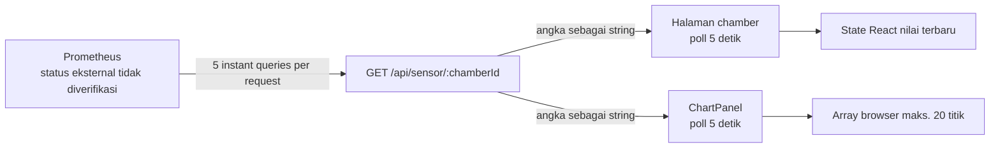

# Audit Implementasi e-Sniffer Udang Saat Ini

Dokumen ini mencatat **fakta yang ditemukan dalam repository** per 30 September 2026. Keputusan target ada di [03-technical-design.md](./03-technical-design.md), kebutuhan yang dapat diuji ada di [02-skpl.md](./02-skpl.md), dan urutan perubahan ada di [04-implementation-plan.md](./04-implementation-plan.md).

## 1. Metode dan batas audit

- Worktree bersih saat audit (`git status --short --branch` hanya menampilkan `main...origin/main`).
- Audit bersifat statis. Tidak ada commit, push, deployment, instalasi dependency, koneksi ke layanan eksternal, atau migration database.
- Isi file environment tidak dibuka. Keberadaan atau kesehatan Prometheus di luar repository tidak diverifikasi.
- `node_modules` tidak tersedia, sehingga build/lint tidak dijalankan dan dokumentasi lokal Next.js yang diminta `AGENTS.md` juga belum ada. Kesesuaian API diperiksa terhadap dokumentasi resmi Next.js 16.3.x; versi terkunci di repository adalah 16.3.0.

Label yang dipakai:

- **Fakta**: dibuktikan oleh file repository.
- **Usulan**: keputusan target yang belum diimplementasikan.
- **Asumsi**: belum dapat dibuktikan dan perlu dikonfirmasi bila memengaruhi implementasi.

## 2. Snapshot teknologi dan struktur

| Area | Fakta | Bukti |
|---|---|---|
| Framework | Next.js `16.3.0`, React/React DOM `19.2.8`, TypeScript, App Router | `package.json`, `package-lock.json` |
| UI | Tailwind CSS 4 dan Recharts `3.10.1` | `package.json`, `app/globals.css`, `components/charts/ChartPanel.tsx` |
| API HTTP | Satu Route Handler GET dinamis | `app/api/sensor/[chamberId]/route.ts` |
| Sumber data | Prometheus HTTP instant query | `lib/prometheus.ts` |
| Database/ORM | Tidak ada dependency, schema, migration, atau kode koneksi database | `package.json`; hasil inventaris file repository |
| MQTT | Tidak ada client, worker, kontrak payload, atau konfigurasi broker | `package.json`; hasil inventaris file repository |
| Autentikasi | Tidak ditemukan middleware, session, pengguna, atau pemeriksaan otorisasi | `app/`, `lib/`, `package.json` |
| Deployment | Belum ada Dockerfile/Compose; README masih template create-next-app/Vercel | `README.md`, `next.config.ts` |
| Script mutu | Hanya `dev`, `build`, `start`, `lint`; belum ada test | `package.json:5-9` |

Struktur aplikasi yang relevan:

```text
app/
├── api/sensor/[chamberId]/route.ts
├── chamber/[chamberId]/page.tsx
├── globals.css
└── layout.tsx
components/
├── charts/ChartPanel.tsx
├── layout/{ExportPanel,Header}.tsx
└── ui/{MetricCard,SensorCard}.tsx
lib/prometheus.ts
```

`README.md:19` menyebut `app/page.tsx`, tetapi file tersebut tidak ada. Rute UI yang ditemukan hanya `/chamber/[chamberId]`.

## 3. Alur data aktual



1. Halaman membaca `chamberId` dari URL dengan `useParams` (`app/chamber/[chamberId]/page.tsx:10-12`).
2. Halaman memanggil `/api/sensor/{chamberId}` saat mount lalu setiap 5 detik (`app/chamber/[chamberId]/page.tsx:22-40`).
3. `ChartPanel` secara terpisah memanggil endpoint yang sama saat mount lalu setiap 5 detik (`components/charts/ChartPanel.tsx:12-56`). Satu browser karena itu memicu dua request API per interval.
4. Setiap request API menjalankan lima query Prometheus secara paralel untuk suhu, kelembapan, MQ-137, MQ-136, dan MQ-4 (`app/api/sensor/[chamberId]/route.ts:14-24`). Dengan dua poller, kondisi stabilnya adalah sepuluh instant query Prometheus per 5 detik per tab.
5. Adapter Prometheus memanggil `/api/v1/query`, mengambil elemen hasil pertama, dan mengembalikan angka (`lib/prometheus.ts:3-15`). Ini adalah query nilai saat ini, bukan range query.
6. Route Handler mengubah semua angka menjadi string berformat tetap sebelum mengirim JSON (`app/api/sensor/[chamberId]/route.ts:26-32`). Tidak ada timestamp pengukuran, timestamp penerimaan, kualitas, satuan terstruktur, identitas perangkat, `message_id`, `boot_id`, uptime, atau referensi waktu.

Karena metadata tersebut tidak ada, implementasi saat ini tidak dapat membuktikan kapan sensor benar-benar diukur, membedakan retry dari pesan baru, merekonstruksi waktu backlog, atau memetakan paket terlambat ke penempatan perangkat historis. Waktu browser pada grafik hanya waktu fetch dan tidak boleh dianggap waktu pengukuran.

Penggunaan `params: Promise<...>` dan `await params` pada Route Handler sesuai kontrak Route Handler Next.js 16.3.x. Referensi resmi: [Next.js route.js](https://nextjs.org/docs/app/api-reference/file-conventions/route).

## 4. Perilaku Prometheus dan penanganan kegagalan

**Fakta:** `lib/prometheus.ts:6` memakai `NEXT_PUBLIC_PROMETHEUS_URL`, walaupun akses dilakukan dari server. Prefiks `NEXT_PUBLIC_` menandakan nilai boleh tersedia pada bundle browser dan tidak boleh dipakai untuk rahasia. URL ini bukan bukti Prometheus sedang aktif.

**Fakta:** saat environment variable tidak ada, target menjadi `http://localhost:9090` (`lib/prometheus.ts:5-9`). Dalam container, `localhost` akan berarti container web, bukan container Prometheus.

**Fakta:** kegagalan jaringan, respons kosong, dan status Prometheus selain sukses semuanya menjadi angka `0` (`lib/prometheus.ts:13-19`). Kode juga tidak memeriksa `res.ok` atau bentuk JSON sebelum mengakses nested property. Dampaknya:

- nilai nol yang sah tidak dapat dibedakan dari no-data atau outage;
- sensor gagal tampak seperti pembacaan nol;
- Route Handler hampir selalu memberi HTTP 200;
- `NaN` dapat lolos sebagai string `"NaN"` jika nilai Prometheus tidak numerik;
- tidak ada timeout eksplisit, request ID, atau telemetry internal.

**Fakta:** label PromQL dibentuk langsung dari path parameter tanpa validasi (`app/api/sensor/[chamberId]/route.ts:12-23`). Selain menerima chamber yang tidak ada, karakter khusus dapat mengubah ekspresi PromQL. API target wajib memakai ID tervalidasi dan query parameterized/ORM, bukan interpolasi ekspresi.

## 5. Grafik, polling, state, dan ekspor

### Grafik

- Grafik hanya memuat tiga gas; suhu dan kelembapan tidak digambar (`components/charts/ChartPanel.tsx:27-32,91-93`).
- Setiap respons latest ditambahkan ke array React dan dipotong menjadi 20 elemen (`components/charts/ChartPanel.tsx:34-40`). Jadi grafik mencakup kira-kira 100 detik bila poll tepat 5 detik.
- Label waktu dibuat dari jam browser saat respons diterima, bukan timestamp sensor (`components/charts/ChartPanel.tsx:21-28`).
- State tidak dipersistenkan dan tidak berasal dari endpoint riwayat. Refresh, unmount, atau navigasi chamber menghapus seluruh grafik.
- Setelah kegagalan pertama, `finally` mematikan loading sehingga label berubah menjadi `Live` meskipun data tidak pernah berhasil didapat (`components/charts/ChartPanel.tsx:42-46,65-72`).

### State dan error

- State halaman diinisialisasi dengan string nol, sehingga sebelum request selesai pengguna melihat angka nol, bukan loading (`app/chamber/[chamberId]/page.tsx:14-20`).
- Kedua consumer memanggil `response.json()` tanpa menguji status HTTP (`app/chamber/[chamberId]/page.tsx:25-33`, `components/charts/ChartPanel.tsx:15-45`).
- Error hanya ditulis ke console pada dua consumer (`app/chamber/[chamberId]/page.tsx:31-33`, `components/charts/ChartPanel.tsx:42-45`) dan adapter (`lib/prometheus.ts:17-19`). Tidak ditemukan logger terpusat, level log, `request_id`, atau pelacakan error lintas API dan browser. Tidak ada retry dengan backoff, indikator error, no-data, stale, sensor gagal, atau service unavailable.
- Polling interval tetap 5 detik tanpa koordinasi saat tab tersembunyi dan tanpa pencegahan request overlap.

### Ekspor dan navigasi

- `ExportPanel` hanya sebuah `<div>` visual tanpa link, button handler, parameter rentang, atau download (`components/layout/ExportPanel.tsx:3-14`). Ekspor CSV belum berfungsi.
- Tombol Chamber 1/2 di header tidak memiliki link atau handler dan Chamber 1 selalu diberi gaya aktif (`components/layout/Header.tsx:10-17`).
- Teks `P1 / P2 / P3` juga statis (`components/layout/Header.tsx:19-20`).
- Nama ruangan hanya memetakan ID string `1` ke `X`; nilai lainnya selalu `Y` (`app/chamber/[chamberId]/page.tsx:47-49`). Ini bukan master data chamber.
- Titik warna pada kartu sensor adalah styling statis, bukan status sensor/perangkat (`components/ui/SensorCard.tsx:17-22`).

## 6. Fitur berfungsi versus placeholder

| Fitur | Status dari kode | Catatan |
|---|---|---|
| Halaman chamber dinamis | Parsial | Rute dinamis ada; chamber tidak divalidasi dan metadata chamber hard-coded |
| Nilai terbaru 5 parameter | Parsial | Berfungsi bila Prometheus tersedia dan format respons sesuai; kegagalan disamarkan sebagai 0 |
| Polling 5 detik | Ada | Dua loop independen; 5 detik adalah implementasi aktual, bukan kebutuhan terkonfirmasi |
| Grafik gas | Demo sisi browser | Bukan riwayat; maksimal 20 titik; hilang saat refresh |
| Ekspor CSV | Placeholder | Tidak ada aksi atau endpoint |
| Navigasi chamber | Placeholder | Tombol tidak interaktif |
| Status online/live | Menyesatkan | Berdasarkan selesainya fetch, bukan koneksi perangkat |
| Database, riwayat persisten | Tidak ada | Tidak ada PostgreSQL/Prisma |
| Telemetry MQTT | Tidak ada | Tidak ada worker/broker contract |
| Autentikasi/otorisasi | Tidak ada | Endpoint baca terbuka |
| Deployment VPS | Tidak ada | Tidak ada container/health check/backup |

## 7. Bagian yang dipertahankan dan diubah

### Dapat dipertahankan

- App Router, layout utama, bahasa visual dashboard, dan komponen presentasional.
- Recharts sebagai renderer grafik.
- Route Handler sebagai boundary HTTP browser, dengan kontrak baru terversi.
- Lima parameter awal dan satuannya: suhu °C, kelembapan %RH, serta MQ-137/MQ-136/MQ-4 berlabel **raw**.
- Pola polling dashboard sebagai strategi tahap awal, setelah disatukan dan diberi backoff/state yang benar.

### Perlu diubah

- Prometheus sebagai sumber utama diganti PostgreSQL melalui Prisma setelah jalur baru tervalidasi; adapter lama dipertahankan sementara sebagai rollback.
- Worker MQTT menjadi proses Node.js + TypeScript terpisah, bukan subscription di Route Handler.
- Bentuk respons string/zero-fallback diganti model typed yang membawa timestamp, quality, device, dan freshness.
- Grafik memakai endpoint riwayat/agregasi agar bertahan setelah refresh.
- Polling latest tunggal per halaman; grafik tidak membuat poll latest kedua.
- Logging dan penanganan error memakai kontrak terpusat dengan identitas korelasi. Aturan domain sensor/waktu/deduplikasi yang kelak ditambahkan mempunyai satu definisi yang digunakan jalur terkait.
- Ekspor, navigasi, status, auth, validasi ID, dan error state diimplementasikan nyata.

## 8. Fakta negatif dan hal yang belum terverifikasi

Audit tidak menemukan bukti kode untuk firmware, konfigurasi exporter Prometheus, format telemetry perangkat, jumlah chamber/perangkat, kalibrasi gas, identitas pengguna, atau SLA. Karena itu:

- layanan Prometheus **tidak dinyatakan aktif**;
- nilai raw gas **tidak dinyatakan ppm**;
- angka 5 detik hanya baseline usulan berdasarkan polling sekarang;
- label `ruangan="chamberN"` belum membuktikan relasi perangkat–chamber historis;
- tidak ada klaim bahwa UI saat ini siap produksi.
- tidak ada dasar untuk mengklaim lokasi historis atau freshness pengukuran dari timestamp browser/Prometheus instant response saja.

## 9. Risiko prioritas

1. **Integritas data:** outage dan sensor gagal berubah menjadi nol.
2. **Kehilangan riwayat:** grafik hanya hidup di memory browser.
3. **Keamanan:** API tanpa auth dan parameter PromQL tidak divalidasi.
4. **Skalabilitas:** setiap tab menggandakan poll dan setiap poll menjadi lima query upstream.
5. **Operasional:** belum ada persistence, backup, health check, atau deployment repeatable.
6. **Semantik status:** tulisan Live tidak membuktikan perangkat online maupun data segar.
