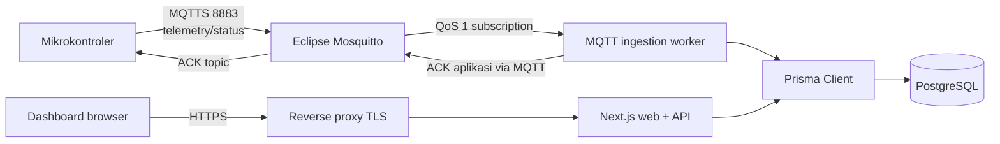
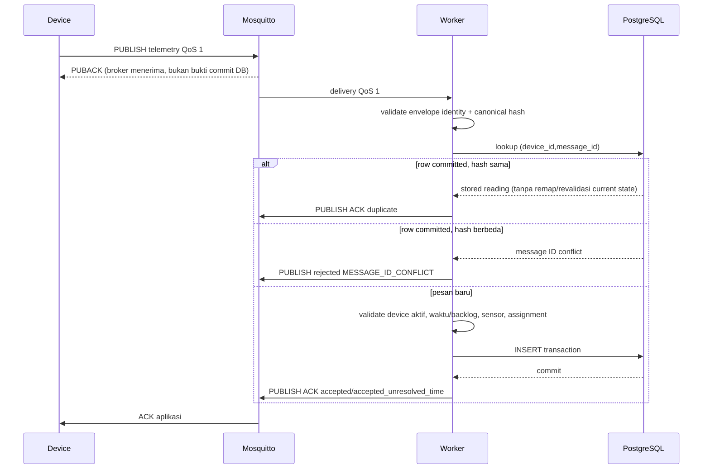
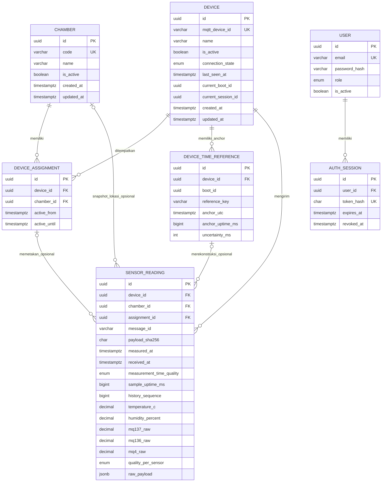

# Rancangan Teknis e-Sniffer Udang

Status dokumen: **usulan arsitektur, belum diimplementasikan**. Baseline kode ada di [01-audit-existing.md](./01-audit-existing.md), kebutuhan normatif ada di [02-skpl.md](./02-skpl.md), dan tahapan delivery ada di [04-implementation-plan.md](./04-implementation-plan.md).

## 1. Keputusan arsitektur

| ID | Keputusan usulan | Alasan |
|---|---|---|
| ADR-001 | Tetap satu repository | Tim dan domain masih kecil; kontrak/type dapat dipakai web dan worker tanpa sinkronisasi antar-repo |
| ADR-002 | Next.js 16 App Router untuk UI dan HTTP API | Mempertahankan implementasi dan versi terkunci saat ini |
| ADR-003 | Worker Node.js + TypeScript sebagai proses/container terpisah | Subscription berumur panjang tidak cocok dibuat per Route Handler atau bergantung lifecycle web |
| ADR-004 | PostgreSQL sebagai source of truth pengukuran | Riwayat, constraint, transaksi, query rentang, dan backup lebih tepat daripada state browser |
| ADR-005 | Prisma ORM `7.9.1` sebagai baseline usulan, diverifikasi lagi saat implementasi | Dokumentasi resmi v7 masih menyatakan major ini fully supported dan memberi contoh pin `7.9.1`; memilihnya mengurangi perubahan kontrak terhadap draft PSL v7. Ini bukan klaim bahwa v7 adalah major terbaru |
| ADR-006 | MQTT 5, telemetry QoS 1, application ACK | QoS 1 memberi at-least-once; unique key memberi idempotensi; ACK aplikasi membedakan delivery broker dari commit DB |
| ADR-007 | Eclipse Mosquitto `2.1.2` sebagai baseline usulan, image dipin digest | Rilis bugfix resmi tersedia; versi/digest tetap diuji bersama konfigurasi plugin sebelum release |
| ADR-008 | Polling browser terukur, bukan MQTT langsung ke browser | MQTT perangkat tidak otomatis membuat UI realtime; polling lebih sederhana dan aman untuk tahap awal |
| ADR-009 | Simpan snapshot `chamber_id` dan assignment pada reading | Paket terlambat harus tetap menunjuk chamber pada saat pengukuran, bukan chamber perangkat saat ini |
| ADR-010 | Tidak ada tabel/materialized “latest” pada tahap awal | Query hanya atas reading dengan waktu ukur known dan berindeks menurut total order mencegah backlog lama menimpa latest; optimasi hanya bila bukti beban menuntut |
| ADR-011 | Akun lokal + session opaque sebagai baseline auth **usulan** | Tidak ada IdP yang diberikan dan deployment awal satu VPS; tetap memerlukan persetujuan pengguna, dan OIDC eksternal dapat menggantikannya sebelum implementasi |

Keputusan yang masih terbuka dicatat pada §14 dan tidak menghalangi rancangan konseptual.

## 2. Arsitektur konteks



### Tanggung jawab dan batas

| Komponen | Bertanggung jawab | Tidak bertanggung jawab |
|---|---|---|
| Mikrokontroler | Sampling, quality lokal, `boot_id`/sequence, uptime sampling, anchor waktu bila tersedia, buffer persisten terbatas, retry hingga ACK aplikasi, heartbeat + Last Will | Menentukan chamber dari nama bebas; memakai receipt server sebagai waktu sampling; menganggap PUBACK berarti DB committed |
| Mosquitto | Auth device, ACL topic, TLS, QoS/session/retained status, antrean terbatas | Validasi domain payload atau menulis PostgreSQL |
| Worker | Subscribe sekali sebagai daemon, identity+canonical hash, dedupe-first, validasi pesan baru, rekonstruksi waktu, lookup assignment, transaction, status/LWT, ACK aplikasi, observability | HTTP API/dashboard; menjalankan di dalam request Next.js |
| PostgreSQL | Source of truth, FK/unique/index, durability, query history | Menerima MQTT langsung |
| Prisma | Model/type/query/migration artifact | Menjalankan migration otomatis pada setiap replica startup |
| Next.js API | Auth, validation query/body, latest/history/series/export/admin, error contract | Subscription MQTT atau state ingestion in-memory |
| Dashboard | Presentasi, filter, polling latest, request history, state/error | Menjadi penyimpanan riwayat atau mengakses broker/DB langsung |

## 3. Struktur repository usulan

Perubahan minimum mempertahankan `app/`, `components/`, dan `lib/`:

```text
app/
├── api/v1/
│   ├── chambers/...
│   └── devices/...
└── chamber/[chamberId]/page.tsx
components/
├── charts/
├── dashboard/
└── ui/
lib/
├── auth/
├── db/                 # singleton Prisma untuk proses web
├── api/                # validation, error, cursor
├── logging/            # logger, redaksi, konteks korelasi
└── domain/             # query/service tanpa HTTP
worker/
├── index.ts
├── mqtt.ts
├── ingest.ts
└── health.ts
shared/
├── telemetry-schema.ts # validator/type MQTT
├── units.ts
└── status.ts
prisma/
├── schema.prisma
└── migrations/         # baru ada saat tahap implementasi disetujui
generated/prisma/       # output generator; kebijakan commit mengikuti tooling
deploy/
├── compose.yaml
├── Dockerfile
└── mosquitto/
    ├── mosquitto.conf
    └── acl.template
scripts/
└── backup-postgres.sh
```

`prisma.config.ts` berada di root. Web dan worker memakai generated client yang sama tetapi membuat pool proses masing-masing dengan batas kecil. Modul logging bersama hanya menstandarkan format dan redaksi; setiap proses memiliki konfigurasi level/sink sendiri.

### 3.1 Batas fungsi dan penggunaan ulang

Pemisahan berikut mengikuti tahap kerja nyata, bukan jumlah fungsi yang ditargetkan:

| Fungsi/modul konseptual | Input → keluaran | Dipakai oleh |
|---|---|---|
| Parser/validator kontrak telemetry | topic + bytes → envelope valid atau reason permanen | worker dan fixture kontrak |
| Normalisasi sensor | object lima sensor valid → nilai nullable + quality per sensor | ingestion; serializer API membaca hasil tersimpan |
| Canonical hash dan keputusan deduplikasi | payload valid minimal + row committed → new/duplicate/conflict | worker |
| Kebijakan waktu dan assignment | telemetry baru + anchor tersimpan → known/unresolved/rejected dan assignment historis bila known | worker dan rekonsiliasi |
| Pemetaan error domain | typed error → reason MQTT atau status/body HTTP yang sesuai | batas MQTT dan HTTP, melalui satu daftar reason |
| Query latest/history/series | filter tervalidasi → data berindeks | API; dipakai ulang bila ekspor membutuhkan query raw yang sama |

Lapisan bawah meneruskan typed error beserta konteks. Route Handler atau batas pesan worker yang memutuskan outcome dan mencatat error lengkap sekali. Fungsi yang memiliki tanggung jawab berbeda tidak digabung demi mengurangi jumlah fungsi; helper baru perlu pemakai nyata. Review menghapus import, dependency, dan cabang mati sebelum release.

Untuk I/O, gunakan satu client/pool per proses, ambil relasi yang diperlukan dalam query terencana, dan periksa N+1 pada endpoint daftar. Poll latest berasal dari satu pemilik state per chamber/tab. Batasi concurrency worker, queue broker/device, payload, limit halaman, range, dan CSV. Batching hanya diusulkan setelah terbukti menjaga urutan, transaksi, dan ACK pasca commit. Query plan dan load test menjadi dasar klaim performa; kompleksitas tambahan dicatat bersama manfaat dan batasnya.

## 4. Alur dan failure mode

### 4.1 Telemetry normal dan duplikat



ACK `accepted` hanya diterbitkan setelah commit. Bila publish ACK gagal setelah commit, device retry dan mendapat `duplicate`; hasil tetap satu row. “Duplicate” berarti key dan hash canonical sama, bukan sekadar ID sama.

### 4.2 Perangkat offline dan backlog

1. Device menyimpan paket lokal secara FIFO sampai batas antrean. Paket menyimpan `boot_id`, `sequence`, `sample_uptime_ms`, dan snapshot/rujukan anchor waktu yang diperlukan; retry tidak membuat identitas baru.
2. Setelah reconnect, device mengirim oldest-first dengan laju terkendali agar data langsung tidak kelaparan.
3. Waktu ukur berstatus `SYNCED` jika timestamp UTC telah tepercaya saat sampling. Ia berstatus `RECONSTRUCTED` hanya bila worker mempunyai anchor dari boot yang sama: `anchor_utc`, `anchor_uptime_ms`, `sample_uptime_ms`, serta uncertainty yang masih dalam batas. Rumus konseptualnya `anchor_utc - (anchor_uptime_ms - sample_uptime_ms)`.
4. Jika bukti itu tidak ada/tidak valid, `measured_at` tetap null dan `measurement_time_quality=UNKNOWN`. `received_at` hanya waktu ingestion, tidak dipakai sebagai waktu sampling tepercaya.
5. Reading unknown-time disimpan device-scoped dengan `chamber_id`/`assignment_id` null dan outcome `accepted_unresolved_time`. Ia tidak masuk latest, freshness, grafik, ekspor/history chamber, atau klaim lokasi. Rekonsiliasi kemudian hanya boleh dilakukan dari anchor boot yang tervalidasi dan memberikan `history_sequence` baru.
6. Reading known-time dipetakan ke assignment yang aktif pada `measured_at`. Bila tidak ada assignment, sistem tidak mengklaim lokasi dan menolak pesan baru `ASSIGNMENT_NOT_FOUND`.
7. Latest mengurutkan reading eligible menurut `measured_at DESC, received_at DESC, history_sequence DESC`; backlog lama tidak menjadi latest. Timestamp masa depan di luar toleransi ditolak.
8. Antrean penuh tidak boleh diam-diam overwrite: firmware menaikkan counter drop dan mengirimkannya di status berikutnya. Kapasitas/durasi buffer adalah TBD perangkat.

Perilaku deduplikasi terhadap perubahan administrasi:

- committed retry identik selalu diselesaikan dari row tersimpan sebelum pemeriksaan assignment, status device, atau cutoff backlog; pemindahan/disable tidak mengubah ACK `duplicate` maupun lokasi historis row;
- committed retry dengan isi berbeda ditolak `MESSAGE_ID_CONFLICT`;
- pesan **baru** dari device disabled ditolak `DEVICE_DISABLED`;
- pesan baru setelah device pindah dengan known-time diterima hanya bila timestamp masih dalam backlog window dan assignment historis ditemukan;
- pesan baru yang sudah melewati cutoff ditolak `BACKLOG_EXPIRED`, walaupun assignment pernah ada; cutoff tidak diterapkan ulang pada retry yang sudah committed.

### 4.3 Database tidak tersedia

- Insert gagal → tidak ada ACK aplikasi sukses.
- Worker mengklasifikasikan error sebagai temporary, retry dengan exponential backoff+jitter dan membatasi concurrency.
- Karena PUBACK broker bukan commit, device tetap menunggu application ACK dan mempertahankan paket.
- Worker tidak boleh menyimpan antrean tanpa batas di RAM. Backpressure memutus/reduksi konsumsi sesuai kemampuan client; broker persistent queue dan buffer device menjadi lapisan terbatas.
- Web mengembalikan `503 SERVICE_UNAVAILABLE`, tidak mengubah error menjadi array kosong/nol.
- Setelah DB pulih, retry dan unique constraint mengembalikan exactly-once effect pada row meskipun delivery at-least-once.

### 4.4 Restart worker atau broker

- Worker memakai client ID stabil (`esniffer-ingest-v1`), `cleanStart=false`, dan Session Expiry usulan 24 jam/TBD.
- Broker memakai persistence volume. `max_queued_messages` dan `max_queued_bytes` wajib finite; angka ditetapkan lewat soak test.
- SIGTERM worker: berhenti mengambil kerja baru, selesaikan transaksi aktif dalam grace period, tutup MQTT dan Prisma.
- Setelah restart, redelivery aman karena unique constraint.
- Broker restart memuat persistence. Device reconnect dengan backoff+jitter dan session/queue lokal.

### 4.5 Dashboard meminta latest dan history

```mermaid
sequenceDiagram
    participant B as Browser
    participant A as Next.js API
    participant P as PostgreSQL

    B->>A: GET latest
    A->>P: latest reading + device state
    P-->>A: typed data
    A-->>B: values, quality, measured_at, connection, freshness
    loop interval adaptif (usulan 5 s)
        B->>A: GET latest (satu poller)
    end
    B->>A: GET series?from&to&bucket
    A->>P: aggregate persisted history
    A-->>B: time buckets
    Note over B: refresh mengulang query; grafik tidak hilang
```

Tab tersembunyi menurunkan frekuensi (usulan 30 detik), request memiliki timeout, tidak overlap, dan error memakai capped exponential backoff. MQTT bukan channel browser pada tahap ini.

## 5. Model data logis

### 5.1 ERD



### 5.2 Kamus data

| Entitas.field | Tipe/logika | Null | Aturan |
|---|---|---:|---|
| `chambers.id` | UUID | Tidak | PK immutable |
| `chambers.code` | varchar(32) | Tidak | unik, pola `^[A-Z0-9][A-Z0-9_-]{0,31}$` usulan |
| `chambers.name` | varchar(100) | Tidak | label manusia |
| `chambers.is_active` | boolean | Tidak | soft disable; tidak menghapus history |
| `devices.id` | UUID | Tidak | PK internal |
| `devices.mqtt_device_id` | varchar(64) | Tidak | unik, immutable, cocok topic/payload |
| `devices.connection_state` | enum | Tidak | `UNKNOWN`, `ONLINE`, `OFFLINE`; berbeda dari freshness |
| `devices.connection_evidence` | enum | Tidak | `NONE`, `LIVE_STATUS`, `LIVE_TELEMETRY`, `RETAINED_SNAPSHOT`, `LWT` |
| `devices.last_seen_at` | timestamptz | Ya | waktu server menerima heartbeat/status/telemetry **live**; retained replay tidak memajukan nilai ini |
| `devices.last_status_processed_at` | timestamptz | Ya | waktu worker memproses status termasuk retained; bukan bukti last seen |
| `devices.current_boot_id/session_id` | UUID | Ya | identitas boot dan koneksi MQTT yang sedang dipercaya |
| `device_assignments.active_from` | timestamptz | Tidak | inklusif |
| `device_assignments.active_until` | timestamptz | Ya | eksklusif; null berarti aktif |
| `device_time_references` | anchor per device+boot+reference key | Tidak | menyimpan UTC, uptime, source, uncertainty; tidak boleh dipakai lintas boot |
| `sensor_readings.message_id` | varchar(128) | Tidak | unik dalam satu device; tetap saat retry |
| `sensor_readings.payload_sha256` | char(64) | Tidak | SHA-256 hex dari seluruh payload JSON canonical untuk deteksi konflik ID |
| `sensor_readings.boot_id/sequence` | UUID/bigint | Tidak | asal message ID dan korelasi rekonstruksi waktu |
| `sensor_readings.sample_uptime_ms` | bigint | Ya | uptime monotonic saat sampling; bukan epoch |
| `sensor_readings.measured_at` | timestamptz | Ya | hanya UTC tepercaya (`SYNCED`/`RECONSTRUCTED`); null jika unknown |
| `sensor_readings.received_at` | timestamptz | Tidak | server time saat ingest |
| `sensor_readings.measurement_time_quality` | enum | Tidak | `SYNCED`, `RECONSTRUCTED`, `UNKNOWN`; `UNKNOWN` mewajibkan measured/chamber/assignment null |
| `sensor_readings.time_reference_id` | UUID FK | Ya | row anchor yang digunakan; wajib untuk reconstructed |
| `sensor_readings.time_uncertainty_ms` | integer | Ya | estimasi error waktu; wajib untuk reconstructed |
| `sensor_readings.history_sequence` | bigint unik | Ya | diberikan saat reading menjadi eligible history; watermark pagination |
| `temperature_c` | decimal(7,3) | Ya | °C; null bila gagal/invalid |
| `humidity_percent` | decimal(6,3) | Ya | %RH; null bila gagal/invalid |
| `mq*_raw` | decimal(14,3) | Ya | unit raw sensor, **bukan ppm** |
| `*_quality` | enum | Tidak | `OK`, `SENSOR_ERROR`, `OUT_OF_RANGE`, `MISSING` |
| `raw_payload` | jsonb | Tidak | payload asli tervalidasi untuk trace/debug; akses terbatas dan retensi dapat lebih pendek |
| `ingestion_source` | enum | Tidak | `MQTT` atau `PROMETHEUS_IMPORT` |
| `users.email/password_hash` | varchar | Tidak | akun lokal usulan; hash satu arah, tidak pernah plaintext |
| `auth_sessions.token_hash` | char(64) | Tidak | hash token session opaque; token mentah hanya di secure cookie |

Kualitas bersifat per sensor karena satu sensor dapat gagal sementara sensor lain valid. Error struktur—JSON malformed, schema/identity salah, key sensor wajib tidak ada, tipe tidak sah, atau payload terlalu besar—menolak paket. Error akuisisi per sensor yang dinyatakan dengan object valid (`SENSOR_ERROR`, `OUT_OF_RANGE`, `MISSING`) tidak menolak paket; nilai normalized sensor itu null dan sensor lain tetap disimpan. Nilai asli masih dapat diaudit melalui payload bila aman. Rentang masuk akal sensor harus dikonfirmasi dari hardware/kalibrasi dan tidak dipalsukan di rancangan.

### 5.3 Penempatan historis

Untuk waktu known, worker memilih assignment dengan aturan `active_from <= measured_at AND (active_until IS NULL OR measured_at < active_until)`. `chamber_id` dan `assignment_id` lalu disalin ke reading. Pemindahan perangkat tidak mengubah reading lama. Untuk waktu unknown, kedua FK tetap null; assignment saat receipt tidak boleh ditebak. Anchor dari telemetry/status di-upsert ke `device_time_references` berdasarkan device+boot+reference key. Jika anchor boot tepercaya kemudian memungkinkan rekonstruksi, proses rekonsiliasi mengisi `measured_at`, time-reference FK, quality waktu, assignment/chamber, dan `history_sequence` secara atomik atau tetap unresolved bila assignment tak dapat dibuktikan.

Prisma belum dapat mengekspresikan constraint exclusion rentang secara lengkap. Migration implementasi perlu SQL PostgreSQL untuk mencegah overlap per device (misalnya exclusion constraint berbasis `tstzrange`) atau transaksi serializable/advisory lock bila extension tidak disetujui. Ini harus diuji; draft schema saja belum cukup. Bila asumsi A-04 disahkan, overlap chamber juga dilarang.

### 5.4 Draft Prisma ORM 7

Draft berikut **hanya dokumentasi**; tidak ada `schema.prisma` atau migration yang diterapkan pada tahap ini. Prisma 7 memerlukan output generator eksplisit dan URL datasource diletakkan di `prisma.config.ts`.

```prisma
generator client {
  provider = "prisma-client"
  output   = "../generated/prisma"
}

datasource db {
  provider = "postgresql"
}

enum ConnectionState {
  UNKNOWN
  ONLINE
  OFFLINE
}

enum ConnectionEvidence {
  NONE
  LIVE_STATUS
  LIVE_TELEMETRY
  RETAINED_SNAPSHOT
  LWT
}

enum SensorQuality {
  OK
  SENSOR_ERROR
  OUT_OF_RANGE
  MISSING
}

enum MeasurementTimeQuality {
  SYNCED
  RECONSTRUCTED
  UNKNOWN
}

enum IngestionSource {
  MQTT
  PROMETHEUS_IMPORT
}

enum UserRole {
  VIEWER
  ADMIN
}

model Chamber {
  id          String             @id @default(uuid()) @db.Uuid
  code        String             @unique @db.VarChar(32)
  name        String             @db.VarChar(100)
  description String?            @db.VarChar(500)
  isActive    Boolean            @default(true) @map("is_active")
  createdAt   DateTime           @default(now()) @map("created_at") @db.Timestamptz(3)
  updatedAt   DateTime           @updatedAt @map("updated_at") @db.Timestamptz(3)
  assignments DeviceAssignment[]
  readings    SensorReading[]

  @@map("chambers")
}

model Device {
  id                    String             @id @default(uuid()) @db.Uuid
  mqttDeviceId          String             @unique @map("mqtt_device_id") @db.VarChar(64)
  name                  String             @db.VarChar(100)
  isActive              Boolean            @default(true) @map("is_active")
  connectionState       ConnectionState    @default(UNKNOWN) @map("connection_state")
  connectionEvidence    ConnectionEvidence @default(NONE) @map("connection_evidence")
  currentBootId         String?            @map("current_boot_id") @db.Uuid
  currentSessionId      String?            @map("current_session_id") @db.Uuid
  currentConnectionSeq  BigInt?            @map("current_connection_seq") @db.BigInt
  currentStatusSequence BigInt?            @map("current_status_sequence") @db.BigInt
  lastSeenAt            DateTime?          @map("last_seen_at") @db.Timestamptz(3)
  lastStatusEventAt     DateTime?          @map("last_status_event_at") @db.Timestamptz(3)
  lastStatusProcessedAt DateTime?          @map("last_status_processed_at") @db.Timestamptz(3)
  firmwareVersion       String?            @map("firmware_version") @db.VarChar(64)
  createdAt             DateTime           @default(now()) @map("created_at") @db.Timestamptz(3)
  updatedAt             DateTime           @updatedAt @map("updated_at") @db.Timestamptz(3)
  assignments           DeviceAssignment[]
  timeReferences        DeviceTimeReference[]
  readings              SensorReading[]

  @@map("devices")
}

model DeviceAssignment {
  id          String          @id @default(uuid()) @db.Uuid
  deviceId    String          @map("device_id") @db.Uuid
  chamberId   String          @map("chamber_id") @db.Uuid
  activeFrom  DateTime        @map("active_from") @db.Timestamptz(3)
  activeUntil DateTime?       @map("active_until") @db.Timestamptz(3)
  createdAt   DateTime        @default(now()) @map("created_at") @db.Timestamptz(3)
  device      Device          @relation(fields: [deviceId], references: [id], onDelete: Restrict)
  chamber     Chamber         @relation(fields: [chamberId], references: [id], onDelete: Restrict)
  readings    SensorReading[]

  @@index([deviceId, activeFrom(sort: Desc)])
  @@index([chamberId, activeFrom(sort: Desc)])
  @@map("device_assignments")
}

model DeviceTimeReference {
  id               String          @id @default(uuid()) @db.Uuid
  deviceId         String          @map("device_id") @db.Uuid
  bootId           String          @map("boot_id") @db.Uuid
  referenceKey     String          @map("reference_key") @db.VarChar(128)
  anchorUtc        DateTime        @map("anchor_utc") @db.Timestamptz(3)
  anchorUptimeMs   BigInt          @map("anchor_uptime_ms") @db.BigInt
  uncertaintyMs    Int             @map("uncertainty_ms")
  source           String          @db.VarChar(32)
  receivedAt       DateTime        @default(now()) @map("received_at") @db.Timestamptz(3)
  device           Device          @relation(fields: [deviceId], references: [id], onDelete: Restrict)
  readings         SensorReading[]

  @@unique([deviceId, bootId, referenceKey])
  @@index([deviceId, bootId, anchorUptimeMs])
  @@map("device_time_references")
}

model SensorReading {
  id                     String                 @id @default(uuid()) @db.Uuid
  deviceId               String                 @map("device_id") @db.Uuid
  chamberId              String?                @map("chamber_id") @db.Uuid
  assignmentId           String?                @map("assignment_id") @db.Uuid
  messageId              String                 @map("message_id") @db.VarChar(128)
  payloadSha256          String                 @map("payload_sha256") @db.Char(64)
  bootId                 String                 @map("boot_id") @db.Uuid
  sequence               BigInt                 @db.BigInt
  sampleUptimeMs         BigInt?                @map("sample_uptime_ms") @db.BigInt
  measuredAt             DateTime?              @map("measured_at") @db.Timestamptz(3)
  receivedAt             DateTime               @default(now()) @map("received_at") @db.Timestamptz(3)
  measurementTimeQuality MeasurementTimeQuality @map("measurement_time_quality")
  timeReferenceId        String?                @map("time_reference_id") @db.Uuid
  timeUncertaintyMs      Int?                   @map("time_uncertainty_ms")
  historySequence        BigInt?                @unique @map("history_sequence") @db.BigInt
  ingestionSource        IngestionSource        @default(MQTT) @map("ingestion_source")
  temperatureC           Decimal?               @map("temperature_c") @db.Decimal(7, 3)
  temperatureQuality     SensorQuality          @map("temperature_quality")
  humidityPercent        Decimal?               @map("humidity_percent") @db.Decimal(6, 3)
  humidityQuality        SensorQuality          @map("humidity_quality")
  mq137Raw               Decimal?               @map("mq137_raw") @db.Decimal(14, 3)
  mq137Quality           SensorQuality          @map("mq137_quality")
  mq136Raw               Decimal?               @map("mq136_raw") @db.Decimal(14, 3)
  mq136Quality           SensorQuality          @map("mq136_quality")
  mq4Raw                 Decimal?               @map("mq4_raw") @db.Decimal(14, 3)
  mq4Quality             SensorQuality          @map("mq4_quality")
  rawPayload             Json                   @map("raw_payload") @db.JsonB
  device                 Device                 @relation(fields: [deviceId], references: [id], onDelete: Restrict)
  chamber                Chamber?               @relation(fields: [chamberId], references: [id], onDelete: Restrict)
  assignment             DeviceAssignment?      @relation(fields: [assignmentId], references: [id], onDelete: Restrict)
  timeReference          DeviceTimeReference?   @relation(fields: [timeReferenceId], references: [id], onDelete: Restrict)

  @@unique([deviceId, messageId])
  @@index([chamberId, measuredAt(sort: Desc), receivedAt(sort: Desc), historySequence(sort: Desc)])
  @@index([deviceId, measuredAt(sort: Desc), receivedAt(sort: Desc), historySequence(sort: Desc)])
  @@index([assignmentId, measuredAt(sort: Desc)])
  @@index([bootId, sampleUptimeMs])
  @@map("sensor_readings")
}

model User {
  id               String        @id @default(uuid()) @db.Uuid
  email            String        @unique @db.VarChar(254)
  passwordHash     String        @map("password_hash") @db.VarChar(255)
  role             UserRole      @default(VIEWER)
  isActive         Boolean       @default(true) @map("is_active")
  failedLoginCount Int           @default(0) @map("failed_login_count")
  lockedUntil      DateTime?     @map("locked_until") @db.Timestamptz(3)
  lastLoginAt      DateTime?     @map("last_login_at") @db.Timestamptz(3)
  createdAt        DateTime      @default(now()) @map("created_at") @db.Timestamptz(3)
  updatedAt        DateTime      @updatedAt @map("updated_at") @db.Timestamptz(3)
  sessions         AuthSession[]

  @@map("users")
}

model AuthSession {
  id         String    @id @default(uuid()) @db.Uuid
  userId     String    @map("user_id") @db.Uuid
  tokenHash  String    @unique @map("token_hash") @db.Char(64)
  expiresAt  DateTime  @map("expires_at") @db.Timestamptz(3)
  lastUsedAt DateTime  @default(now()) @map("last_used_at") @db.Timestamptz(3)
  revokedAt  DateTime? @map("revoked_at") @db.Timestamptz(3)
  createdAt  DateTime  @default(now()) @map("created_at") @db.Timestamptz(3)
  user       User      @relation(fields: [userId], references: [id], onDelete: Cascade)

  @@index([userId, expiresAt])
  @@map("auth_sessions")
}
```

Draft `prisma.config.ts` konseptual:

```ts
import "dotenv/config";
import { defineConfig, env } from "prisma/config";

export default defineConfig({
  schema: "prisma/schema.prisma",
  migrations: { path: "prisma/migrations" },
  datasource: { url: env("DATABASE_URL") },
});
```

Constraint lintas-field berikut tidak sepenuhnya dinyatakan oleh Prisma dan harus direview sebagai SQL migration: known-time mewajibkan `measured_at`, chamber, assignment, dan history sequence; unknown-time mewajibkan semuanya null; `RECONSTRUCTED` mewajibkan reference+uncertainty; quality `OK` mewajibkan value sedangkan quality gagal mewajibkan null; `history_sequence` mengambil nilai dari sequence PostgreSQL hanya ketika reading menjadi visible. Reading visible bersifat immutable.

Runtime Prisma `7.9.1` memerlukan PostgreSQL driver adapter; baseline usulan adalah `@prisma/adapter-pg` dengan versi kompatibel dan package ESM. Dokumentasi resmi harus diperiksa kembali saat install karena proyek saat ini belum memiliki Prisma dan Node runtime production belum dipin.

### 5.5 Canonical payload, deduplikasi, dan pagination key

Worker menolak duplicate JSON member names, memvalidasi encoding/number, lalu menerapkan JSON Canonicalization Scheme (RFC 8785) pada **seluruh payload telemetry** termasuk message/time/sensor metadata. SHA-256 bytes canonical disimpan sebagai lowercase hex `payload_sha256`. Normalisasi database (misalnya mengubah sensor out-of-range menjadi null) tidak dipakai sebagai input hash agar perubahan isi asli tetap terdeteksi.

Urutan pemrosesan:

1. enforce byte limit, parse ketat, validasi format minimal `schema_version/device_id/message_id`, serta cocokkan identity topic;
2. canonicalize dan hash;
3. lookup committed row `(device_id,message_id)`;
4. jika hash sama, ACK `duplicate` memakai reading/assignment tersimpan tanpa memeriksa device active, assignment kini, atau cutoff backlog;
5. jika hash berbeda, reject permanen `MESSAGE_ID_CONFLICT` dan emit security/firmware metric;
6. hanya bila row belum ada, lakukan full schema, device active, sensor, time/backlog, dan assignment validation sebelum insert atomik.

`history_sequence` adalah nomor global monoton yang dialokasikan saat reading pertama kali menjadi eligible untuk history chamber. Ia juga menjadi tie-breaker unik dan watermark. Halaman history memakai total order `measured_at DESC, received_at DESC, history_sequence DESC`; semua field sort ada dalam cursor.

### 5.6 Volume dan retensi

Rumus row/hari:

```text
jumlah perangkat × 86.400 / interval detik
```

Pada usulan 5 detik: `17.280 × jumlah perangkat` row/hari.

| Perangkat | Row/hari | Row/30 hari | Row/365 hari |
|---:|---:|---:|---:|
| 1 | 17.280 | 518.400 | 6.307.200 |
| 10 | 172.800 | 5.184.000 | 63.072.000 |
| 30 | 518.400 | 15.552.000 | 189.216.000 |

Ukuran byte/row harus diukur pada schema final termasuk index dan JSONB. Jangan mengaktifkan partisi hanya dari estimasi. Tahap pilot tidak hard-delete otomatis; pasang pengukuran pertumbuhan. Retensi online usulan awal 180 hari/TBD, baru diaktifkan setelah kebutuhan riset, jumlah device, kapasitas VPS, dan kebijakan arsip disetujui. Purge kelak harus batch, terobservasi, dan tidak mencakup master/assignment.

## 6. Kontrak MQTT v1

### 6.1 Topic

```text
esniffer/v1/devices/{device_id}/telemetry
esniffer/v1/devices/{device_id}/status
esniffer/v1/devices/{device_id}/ack
```

- `device_id` hanya karakter `[A-Za-z0-9_-]`, maksimal 64.
- Device publish `telemetry` dan `status`, subscribe `ack` miliknya.
- Worker subscribe `esniffer/v1/devices/+/telemetry` dan `.../status`, publish `.../ack`.
- ACL mengikat username/client identity ke satu `{device_id}`. Wildcard publish device dilarang.

### 6.2 Payload telemetry

```json
{
  "schema_version": 1,
  "device_id": "esp32-001",
  "message_id": "550e8400-e29b-41d4-a716-446655440000:0000000042",
  "boot_id": "550e8400-e29b-41d4-a716-446655440000",
  "sequence": 42,
  "sample_uptime_ms": 187325,
  "measured_at": "2026-09-30T07:15:32.125Z",
  "clock_synced": true,
  "time_reference": {
    "reference_id": "ntp-550e8400-3",
    "anchor_utc": "2026-09-30T07:15:30.000Z",
    "anchor_uptime_ms": 185200,
    "uncertainty_ms": 50,
    "source": "ntp"
  },
  "firmware_version": "1.0.0",
  "sensors": {
    "temperature_c": { "value": 27.125, "quality": "ok" },
    "humidity_percent": { "value": 78.25, "quality": "ok" },
    "mq137_raw": { "value": 1834, "quality": "ok" },
    "mq136_raw": { "value": null, "quality": "sensor_error" },
    "mq4_raw": { "value": 912, "quality": "ok" }
  }
}
```

Field wajib: `schema_version`, `device_id`, `message_id`, `boot_id`, `sequence`, `sample_uptime_ms`, `clock_synced`, dan kelima key sensor beserta `quality`. `measured_at` wajib RFC 3339 UTC bila jam tepercaya saat sampling dan null jika tidak. `time_reference` opsional, tetapi diperlukan untuk merekonstruksi sampel yang dibuat sebelum sinkronisasi; anchor harus berasal dari boot yang sama dan disimpan bersama queued packet atau dapat dirujuk secara immutable. `firmware_version` opsional namun dianjurkan.

`boot_id` adalah UUID acak baru per boot dan `sequence` counter monoton dalam boot. `message_id = boot_id:sequence`, dibuat saat sampling dan disimpan bersama paket antrean. Retry tidak pernah membuat ID baru dan harus mengirim payload lengkap yang canonical-equivalent; firmware tidak boleh menambahkan/mengubah metadata opsional pada retry dengan ID lama. Entropi boot ID mencegah bentrok setelah reboot; worker memvalidasi konsistensinya.

Aturan sensor:

- quality `ok` mensyaratkan finite JSON number. Bila angka finite di luar batas server yang telah dikonfirmasi, paket tetap valid secara struktur tetapi nilai sensor dinormalisasi null dengan quality `OUT_OF_RANGE`; raw payload tetap menyimpan angka asal;
- `sensor_error`, `out_of_range`, atau `missing` yang dilaporkan device mensyaratkan `value:null`;
- JSON malformed, `NaN`/`Infinity`, string angka, object sensor wajib hilang, field asing berlebihan, atau duplicate keys adalah error struktur dan menolak seluruh paket;
- raw gas tidak boleh diberi nama/konversi ppm tanpa versi kalibrasi baru.

Hash deduplikasi dihitung dari seluruh payload JSON canonical **sebelum** normalisasi per-sensor. Dengan demikian retry identik tetap sama, sedangkan perubahan satu nilai/quality/time metadata dengan ID lama terdeteksi sebagai konflik.

### 6.3 Timestamp

- Toleransi masa depan dan umur maksimum ingestion adalah konfigurasi server, usulan awal `+2 menit` dan backlog `7 hari`, keduanya TBD.
- Jika NTP/RTC belum tepercaya, device mengirim `clock_synced=false` dan `measured_at:null`. Worker **tidak** menyalin `received_at` ke `measured_at`.
- Waktu boleh direkonstruksi hanya dari `sample_uptime_ms` dan anchor `anchor_utc/anchor_uptime_ms` dengan `boot_id` sama, counter monotonic tidak wrap/reset, serta uncertainty dalam batas konfigurasi. Firmware perlu mempertahankan `boot_id`, lebar/wrap counter, reference ID, source, uncertainty, dan anchor untuk paket backlog.
- Tanpa bukti cukup, reading berstatus `UNKNOWN`, tanpa chamber/assignment, dan hanya tersedia pada audit device/unresolved queue. Ia tidak memengaruhi latest/freshness/grafik.
- Timestamp terlalu jauh masa depan ditolak permanen agar tidak merusak latest.
- Kebijakan backlog lebih lama dari batas ditentukan sebelum pilot; jangan retry tanpa akhir terhadap `rejected` permanen.

### 6.4 Payload status, heartbeat, dan Last Will

Payload status v1:

```json
{
  "schema_version": 1,
  "device_id": "esp32-001",
  "boot_id": "550e8400-e29b-41d4-a716-446655440000",
  "session_id": "d4f497e4-c782-43da-bf5d-4a2fd704d4dc",
  "connection_sequence": 3,
  "status_sequence": 17,
  "event_type": "heartbeat",
  "state": "online",
  "uptime_ms": 187500,
  "event_at": "2026-09-30T07:15:32.300Z",
  "clock_synced": true,
  "firmware_version": "1.0.0",
  "queue": { "depth": 4, "capacity": 2048, "dropped_total": 0 },
  "time_reference": {
    "reference_id": "ntp-550e8400-3",
    "anchor_utc": "2026-09-30T07:15:30.000Z",
    "anchor_uptime_ms": 185200,
    "uncertainty_ms": 50,
    "source": "ntp"
  }
}
```

- `boot_id` baru setiap boot. `session_id` baru setiap koneksi MQTT. `connection_sequence` naik tiap koneksi dalam boot dan harus dipersistenkan selama boot; `status_sequence` naik tiap status dalam session.
- Saat connect, device memasang retained LWT dengan session/boot yang sama, `event_type="will"`, `state="offline"`, dan `event_at:null` karena waktu disconnect belum diketahui. Setelah CONNACK, device publish retained `connect/online`; heartbeat periodik (usulan 15 detik/TBD) memperbarui retained snapshot. Queue/time anchor ikut heartbeat bila berubah.
- Worker hanya menerapkan LWT offline bila boot/session/connection sequence cocok dengan session aktif yang tersimpan; LWT session lama dicatat tetapi tidak menimpa session baru.
- `event_at` dipercaya hanya jika clock sinkron. Untuk live heartbeat/telemetry, `last_seen_at` adalah receipt server saat paket live diterima; ini sengaja berbeda dari event time.
- Saat worker restart, broker mengirim status retained. Retained `online` **bukan bukti koneksi baru**: worker mencatat `last_status_processed_at`, menandai evidence `RETAINED_SNAPSHOT`, tidak mengubah `last_seen_at`, dan menetapkan connection state `UNKNOWN` sampai heartbeat atau telemetry live. Retained `offline` dapat menjadi snapshot offline tetapi tidak membuktikan kapan disconnect terjadi.
- `last_status_processed_at` selalu boleh maju ketika replay diproses; `last_seen_at` hanya maju karena traffic live. Packet retain flag dan session identity wajib ikut keputusan state.

### 6.5 QoS, retain, session, limit

| Pesan | QoS | Retain | Catatan |
|---|---:|---:|---|
| telemetry | 1 | false | at-least-once + dedupe DB |
| status connect/heartbeat/LWT | 1 | true | snapshot broker; replay retained diperlakukan berbeda dari traffic live |
| application ACK | 1 | false | diterbitkan sesudah commit atau duplicate terkonfirmasi |

- MQTT 5; device dan worker reconnect exponential backoff+jitter.
- Persistent session untuk worker; Session Expiry usulan 24 jam/TBD. Device dapat memakai session persisten tetapi tetap wajib buffer lokal karena broker ACK bukan DB ACK.
- Payload maksimum usulan 4 KiB. Mosquitto `message_size_limit`, memory limit, inflight, `max_queued_messages`, dan `max_queued_bytes` diset finite setelah capacity test.
- Queue device harus finite, flash-safe, oldest-first, dan mengekspos depth/drop count. Ukuran minimum dihitung dari durasi outage target yang belum dikonfirmasi.
- Telemetry tidak retained agar subscriber baru tidak menyangka sampel lama sebagai baru.

### 6.6 Application ACK

Contoh:

```json
{
  "schema_version": 1,
  "message_id": "550e8400-e29b-41d4-a716-446655440000:0000000042",
  "payload_sha256": "<64-hex>",
  "status": "accepted",
  "reading_id": "9e5f4ee8-69f2-4d6e-8b6a-99503783487b",
  "received_at": "2026-09-30T07:15:32.290Z"
}
```

Status:

- `accepted`: commit berhasil;
- `accepted_unresolved_time`: commit device-scoped berhasil, tetapi waktu/lokasi tidak diketahui dan reading dikecualikan dari view chamber;
- `duplicate`: row dengan key dan hash sama sudah committed; response memakai reading lama dan device boleh menghapus paket;
- `rejected`: error permanen, berisi reason whitelist seperti `SCHEMA_INVALID`, `DEVICE_UNKNOWN`, `DEVICE_DISABLED`, `MESSAGE_ID_CONFLICT`, `ASSIGNMENT_NOT_FOUND`, `TIMESTAMP_INVALID`, atau `BACKLOG_EXPIRED`; device pindahkan ke dead-letter/counter dan jangan retry tanpa akhir.

Error sementara (`DB_UNAVAILABLE`, worker/broker disconnect) **tidak menghasilkan ACK sukses maupun `rejected` permanen**. Ketiadaan ACK memicu retry terjadwal di device. ACK tidak memantulkan stack trace atau detail internal.

## 7. Kontrak HTTP API v1

### 7.1 Konvensi umum

- Base path `/api/v1`; JSON memakai camelCase, waktu RFC 3339 UTC, angka sebagai JSON number dan null eksplisit.
- Auth baseline **usulan**: akun lokal pada tabel `users`/`auth_sessions`, cookie session opaque `HttpOnly`, `Secure`, `SameSite=Lax`, token acak disimpan hanya sebagai SHA-256 hash. Read perlu `viewer` atau `admin`; mutation perlu `admin` plus CSRF token dan Origin check. Tidak ada public signup/reset pada tahap awal. Pengguna harus menyetujui baseline ini atau memilih OIDC sebelum implementasi.
- Respons sukses: `{ "data": ..., "meta": ... }` bila perlu.
- Error: `{ "error": { "code": "...", "message": "...", "details": [], "requestId": "..." } }`.
- Status umum: 400 malformed query, 401 unauthenticated, 403 forbidden, 404 resource, 409 conflict, 413 payload/export terlalu besar, 422 semantic validation, 429 rate limit, 503 dependency unavailable.
- Semua limit di bawah adalah default usulan/TBD dan berada pada konfigurasi server; client tidak dapat menaikkannya.

### 7.2 Autentikasi (usulan baseline)

- `POST /api/v1/auth/login`: body `{email,password,csrfBootstrap}`; response 204 + secure session cookie. Rate limit per IP+account, generic 401, lockout sementara, dan password diverifikasi oleh library hashing terawat. Tidak menerima role dari client.
- `POST /api/v1/auth/logout`: auth+CSRF; revoke hash session dan hapus cookie; response 204.
- `GET /api/v1/auth/session`: response `{user:{id,email,role},expiresAt}` tanpa token/hash.
- Admin pertama dibuat lewat one-shot bootstrap terkontrol dengan password melalui input rahasia, bukan argument/log. Pembuatan/disable akun lanjutan memerlukan endpoint/admin flow terpisah yang diuji sebelum produksi.
- Jika OIDC dipilih menggantikan baseline, dependensi eksplisitnya adalah availability IdP, client ID/secret, redirect URI HTTPS, issuer/JWKS validation, claim-to-role mapping, logout/revocation behavior, dan fallback saat IdP down. Keputusan ini belum dibuat pengguna.

### 7.3 Chamber

#### `GET /api/v1/chambers`

- Query: `active=true|false`, `limit` (default 50, max 100), `cursor` opaque. Keyset order `(code ASC,id ASC)`; concurrent admin mutation hanya best-effort dan tidak memakai history watermark.
- Response: daftar `{id,code,name,isActive,activeDeviceCount}` dan `nextCursor`.
- Auth: viewer/admin. Invalid query 422; DB gagal 503.

#### `POST /api/v1/chambers`

- Body: `{code,name,description?}`; strict object, batas panjang sesuai schema.
- Response 201: chamber. Auth admin+CSRF.
- Error: 409 kode duplikat; 422 validation.

#### `PATCH /api/v1/chambers/{chamberId}`

- Body: subset `{name,description,isActive}`; `code` immutable pada tahap awal.
- Response 200; auth admin+CSRF. 404/409/422 sesuai kondisi.
- Tidak ada DELETE publik pada tahap awal.

### 7.4 Latest

#### `GET /api/v1/chambers/{chamberId}/latest`

- Query opsional `deviceId`; tidak menerima rentang.
- Response ringkas:

```json
{
  "data": {
    "chamber": { "id": "uuid", "code": "CH-01", "name": "Chamber 1" },
    "devices": [{
      "device": { "id": "uuid", "mqttDeviceId": "esp32-001", "name": "Sniffer 1" },
      "connection": {
        "state": "online",
        "evidence": "live_status",
        "bootId": "uuid",
        "sessionId": "uuid",
        "lastSeenAt": "2026-09-30T07:15:34Z",
        "statusProcessedAt": "2026-09-30T07:15:34Z"
      },
      "freshness": { "state": "fresh", "ageSeconds": 2, "thresholdSeconds": 15 },
      "reading": {
        "id": "uuid",
        "measuredAt": "2026-09-30T07:15:32Z",
        "receivedAt": "2026-09-30T07:15:32Z",
        "measurementTimeQuality": "synced",
        "values": {
          "temperatureC": { "value": 27.125, "unit": "°C", "quality": "ok" },
          "humidityPercent": { "value": 78.25, "unit": "%RH", "quality": "ok" },
          "mq137Raw": { "value": 1834, "unit": "raw", "quality": "ok" },
          "mq136Raw": { "value": null, "unit": "raw", "quality": "sensor_error" },
          "mq4Raw": { "value": 912, "unit": "raw", "quality": "ok" }
        }
      }
    }]
  }
}
```

- `reading:null` adalah no eligible data, tetap HTTP 200 untuk chamber sah. Reading unknown-time tidak dipilih sebagai latest; jumlah unresolved device dapat ditampilkan terpisah tanpa klaim chamber bila query dilakukan dari resource device/admin.
- Freshness threshold usulan `max(3 × interval nominal, 15 detik)` dan wajib dikonfirmasi.
- Freshness hanya dihitung dari `measuredAt` known. Bila tidak ada waktu tepercaya, state `unknown` dan `ageSeconds:null`; `receivedAt` tidak dipakai untuk membuatnya fresh.
- Auth viewer/admin; 404 chamber; 503 DB.

### 7.5 Riwayat raw

#### `GET /api/v1/chambers/{chamberId}/readings`

- Query halaman pertama wajib `from`, `to`; opsional `deviceId`, `limit` (default 100, max 500). Halaman lanjut mengirim `cursor`; parameter filter yang dikirim ulang harus identik atau request ditolak.
- Default max range raw 7 hari/TBD. Hanya reading visible dengan waktu known dan assignment chamber cocok yang masuk.
- Total order: `measuredAt DESC, receivedAt DESC, historySequence DESC`. Saat halaman pertama, server membaca `snapshotWatermark=max(history_sequence)` dan membatasi seluruh page ke `history_sequence<=watermark`.
- Cursor opaque ditandatangani/HMAC dan memuat `version`, hash `{chamberId,deviceId,from,to,order}`, snapshot watermark, serta tuple sort terakhir. Cursor kadaluarsa/Tampered/filter mismatch menghasilkan 400/422.
- Response: array reading typed dan `{nextCursor,limit,snapshotWatermark}`.
- Jaminan snapshot: telemetry/backlog/reconciliation yang menjadi visible setelah halaman pertama mendapat history sequence di atas watermark dan tidak muncul di tengah traversal. Ia terlihat pada pagination baru. Jaminan mengandalkan tidak adanya hard-delete/perubahan sort key pada reading visible.
- Auth viewer/admin. 422 untuk `from>=to`, timezone invalid, range/limit lebih; 404 chamber; 503 DB.

### 7.6 Seri grafik

#### `GET /api/v1/chambers/{chamberId}/series`

- Query wajib `from`, `to`; `metrics=temperatureC,humidityPercent,mq137Raw,...`; `bucket=5s|30s|1m|5m|1h` atau `auto`; `deviceId` opsional.
- Maksimal rentang usulan 90 hari dan 1.000 bucket. `auto` memilih bucket terkecil yang tidak melebihi limit.
- Response tiap bucket: `start`, `avg|min|max|last` (strategi final per UI), `validCount`, `invalidCount`. Nilai invalid diabaikan dari agregat numerik, bukan dianggap nol.
- Reading unknown-time/unassigned dikecualikan. Series bukan traversal pagination: setiap request adalah snapshot statement tersendiri; client mengulang request untuk melihat backlog/reconciliation baru.
- Implementasi dapat memakai SQL aman/typed untuk `date_bin`; metric/bucket harus whitelist, tidak diinterpolasi bebas.
- Auth viewer/admin; 422 query; 503 DB.

### 7.7 CSV

#### `GET /api/v1/chambers/{chamberId}/readings.csv`

- Query: `from`, `to`, `deviceId?`; max range 31 hari dan max 500.000 row adalah usulan/TBD berdasarkan load test.
- Streaming `text/csv; charset=utf-8`, `Content-Disposition` filename aman.
- Kolom: chamber/device/message IDs, `measured_at`, `received_at`, `measurement_time_quality`, tiap value+unit+quality, ingestion source. Endpoint chamber mengecualikan unresolved-time; audit device unresolved memerlukan endpoint admin terpisah bila disetujui.
- Escape RFC 4180; prefix nilai string yang berawal `=`, `+`, `-`, `@` untuk mencegah spreadsheet formula injection. Tidak mengekspor `raw_payload` secara default.
- Auth viewer/admin; 413/422 bila batas terlampaui; 503 bila gagal sebelum stream. Bila error sesudah header terkirim, stream dihentikan dan log/correlation ID dicatat.

### 7.8 Perangkat dan assignment

| Method/path | Input | Response/batas | Auth/error |
|---|---|---|---|
| `GET /api/v1/devices` | `active`, `chamberId`, cursor, limit≤100; order `(createdAt DESC,id DESC)` | list status+evidence+assignment aktif+unresolved count; master-list pagination best-effort | viewer/admin; 422/503 |
| `POST /api/v1/devices` | `mqttDeviceId,name` | 201 device; credential provision lewat kanal terpisah, tidak dikembalikan berulang | admin+CSRF; 409/422 |
| `PATCH /api/v1/devices/{id}` | `name,isActive` | updated device | admin+CSRF; 404/422 |
| `POST /api/v1/devices/{id}/assignments` | `chamberId,effectiveFrom` | transaction menutup assignment lama dan membuat baru | admin+CSRF; 404/409/422 |
| `GET /api/v1/devices/{id}/assignments` | cursor, limit≤100; order `(activeFrom DESC,id DESC)` | history assignment; keyset cursor | viewer/admin |
| `GET /api/v1/devices/{id}/readings/unresolved` | `fromReceivedAt`, `toReceivedAt`, cursor, limit≤100; order `(receivedAt DESC,id DESC)` | audit reading tanpa waktu/lokasi; tidak mengklaim chamber/freshness | admin; 422/503 |

Tidak ada endpoint untuk hard-delete reading, chamber, device, atau assignment.

## 8. Semantik dashboard

Dashboard tidak memakai satu enum state. Empat dimensi berikut dirender bersamaan:

| Dimensi | Nilai utama | Sumber/tampilan |
|---|---|---|
| Request | `idle/loading/success/error/refreshing` | skeleton hanya initial loading; error/503 berupa banner dan data cache diberi timestamp |
| Connection | `online/offline/unknown` + evidence | badge sendiri; retained online menghasilkan unknown sampai live evidence |
| Freshness | `fresh/stale/unknown` | dihitung hanya dari measured time known; unknown-time tidak diberi umur palsu |
| Quality per sensor | `ok/sensor_error/out_of_range/missing` | setiap kartu independen; null ditampilkan `—`, bukan 0 |

Kombinasi contoh:

- **online + stale:** heartbeat live baru diterima, tetapi reading known-time terakhir melewati threshold; badge online dan peringatan stale tampil bersamaan;
- **offline + fresh:** LWT session aktif baru diterima sesaat setelah sampel; badge offline tampil sementara nilai masih fresh dan tidak dihapus;
- **satu sensor gagal:** connection online dan freshness fresh, empat sensor dapat `ok`, MQ-136 `sensor_error` dan hanya kartunya menampilkan `—`;
- **request error + cached offline/fresh:** banner layanan unavailable tampil di atas snapshot terakhir; UI tidak mengubah dimensi domain hanya karena fetch gagal.

`reading:null` menghasilkan no-data untuk chamber, sementara unresolved-time count dapat memberi pesan diagnostik admin tanpa menempatkan data ke chamber. Grafik selalu memanggil `/series` berdasarkan rentang URL/state, sehingga refresh merekonstruksi grafik dari PostgreSQL.

## 9. Deployment satu VPS

### 9.1 Layanan dan jaringan Compose

Empat service wajib:

- `web`: Next.js production server, non-root, read-only filesystem sejauh praktis.
- `mqtt-worker`: image build yang sama atau stage berbeda, command worker, non-root.
- `postgres`: major version exact dipin setelah compatibility test.
- `mosquitto`: `2.1.2` sebagai baseline usulan + image digest setelah compatibility test; gunakan plugin ACL/password yang direkomendasikan 2.1, bukan mengandalkan opsi yang telah deprecated.

Network:

- `backend` internal: web, worker, postgres; Postgres hanya listen/terjangkau di network ini dan **tidak memiliki `ports:`**.
- `mqtt` internal: worker dan Mosquitto.
- Mosquitto mempublikasikan hanya `8883/tcp` untuk MQTTS device. Port 1883 bila dipakai worker hanya `expose`, bukan host publish.
- Web bind `127.0.0.1:3000` untuk reverse proxy host, atau berada di network proxy. Hanya 80/443 reverse proxy dan 8883 MQTT yang terbuka firewall.

Reverse proxy TLS direkomendasikan resmi untuk self-hosted Next.js. Ia dapat berjalan di host atau menjadi service kelima setelah pilihan operasional; tidak mengubah empat service domain wajib.

### 9.2 Volume

| Volume | Isi | Backup |
|---|---|---|
| `postgres-data` | cluster PostgreSQL | wajib, logical dump off-host; volume saja bukan backup |
| `mosquitto-data` | persistence sessions/messages | backup sebelum upgrade; bukan pengganti buffer device |
| `mosquitto-log` | opsional log rotasi | tidak wajib jangka panjang bila stdout collector ada |
| bind read-only secrets/config | cert, ACL, password/plugin config | dikelola permission ketat; tidak masuk Git |

### 9.3 Environment variable (nama saja)

```text
DATABASE_URL=postgresql://<user>:<password>@postgres:5432/<database>?schema=public
MQTT_URL=mqtt://mosquitto:1883
MQTT_CLIENT_ID=esniffer-ingest-v1
MQTT_USERNAME=<worker-username>
MQTT_PASSWORD=<worker-password>
MQTT_CA_FILE=<path-if-tls>
AUTH_SECRET=<random-secret>
CURSOR_SIGNING_SECRET=<random-secret-terpisah>
APP_BASE_URL=https://<dashboard-host>
LOG_LEVEL=info
TELEMETRY_MAX_BYTES=4096
DEVICE_STALE_AFTER_SECONDS=<confirmed-value>
```

Tidak ada credential dalam `NEXT_PUBLIC_*`. Compose menggunakan secret file/env yang permission-nya ketat; dokumentasi dan `.env.example` hanya placeholder.

### 9.4 Health, restart, shutdown

- PostgreSQL: `pg_isready`; Mosquitto: process liveness dan authenticated listener readiness; web: `/api/health/live` hanya memeriksa proses/event loop sedangkan `/api/health/ready` memeriksa DB; worker liveness memeriksa process/event-loop progress sedangkan readiness memerlukan DB, MQTT connection, dan subscription aktif.
- `depends_on` health membantu urutan, tetapi aplikasi tetap harus tahan dependency restart.
- `restart: unless-stopped`; bounded retry/backoff agar tidak hot loop.
- `stop_grace_period` cukup untuk menutup HTTP, MQTT, dan pool DB. Handler SIGTERM wajib.
- Outage DB/broker tidak otomatis menggagalkan liveness atau memicu restart loop selama proses sehat; readiness menjadi 503 sampai pulih. Liveness gagal hanya bila proses hang/crash/tidak dapat maju.

### 9.5 Pool database dan migration

- Web dan worker masing-masing memiliki singleton Prisma per process. Batas pool total harus di bawah `max_connections` setelah menyisakan koneksi admin/migration; angka final berdasarkan jumlah replica dan load test.
- Pada satu VPS awal, usulan konservatif web 5 + worker 5 koneksi/TBD. Jangan membuat PrismaClient per request/message.
- Build menjalankan generate client, bukan migration.
- Release menjalankan **satu** one-shot job `prisma migrate deploy` dengan image versi rilis sebelum mengganti web/worker. Jangan menjalankannya serentak dari startup semua replica.
- Migration destructive memerlukan expand/migrate/contract dan backup terverifikasi; rollback aplikasi tidak otomatis membalik schema.

### 9.6 Backup dan pemulihan

- Usulan awal: `pg_dump` terkompresi setiap hari ke penyimpanan off-host terenkripsi; 7 daily + 4 weekly. RPO/RTO masih TBD.
- Simpan versi aplikasi/migration bersama metadata backup dan checksum.
- Restore drill berkala ke database terpisah: restore, jalankan constraint/count/smoke query, catat durasi.
- Bila RPO yang disetujui lebih kecil dari 24 jam, tambahkan WAL archiving/PITR; jangan mengklaim PITR sebelum benar-benar dikonfigurasi dan diuji.
- Backup Mosquitto berguna bagi session/queue, tetapi keselamatan telemetry utama tetap mengandalkan buffer device, idempotensi, dan PostgreSQL.

## 10. Strategi migrasi dari Prometheus

1. **Baseline:** catat respons endpoint lama dan screenshot state relevan; jangan menghapus `lib/prometheus.ts`.
2. **Bangun jalur baru terisolasi:** schema/migration, broker, worker, device uji, API v1.
3. **Firmware canary:** satu perangkat publish MQTT dengan payload v1; bila perlu tetap jalankan jalur Prometheus lama selama observasi.
4. **Verifikasi paralel:** bandingkan nilai/timestamp/gap, duplicate behavior, outage, dan backlog setidaknya selama periode yang disetujui.
5. **Compatibility facade:** pertahankan `/api/sensor/[chamberId]` sementara. Setelah DB dipercaya, facade membaca latest baru tetapi mempertahankan shape string lama untuk UI lama; beri deprecation log/header. Jangan memperluas API lama.
6. **Migrasi UI:** latest typed, series persisten, CSV, status; hilangkan dua poller.
7. **Cutover:** arahkan semua device, pantau acceptance/rejection/lag. Prometheus lama tetap tersedia selama rollback window.
8. **Retire:** hapus adapter/endpoint lama hanya setelah acceptance, backup, dan rollback window selesai melalui perubahan tersendiri.

### Data historis Prometheus

Keputusan default usulan adalah **tidak mengimpor otomatis** sampai cardinality/label diperiksa. Kode kini hanya membuktikan label chamber, bukan device/message ID. Lima time-series juga mungkin memiliki timestamp scrape berbeda, sehingga penggabungan menjadi satu paket berisiko menciptakan data palsu.

Jika identitas device dan korelasi waktu terbukti memadai, lakukan tool import satu kali yang:

- mengambil range query read-only;
- memetakan assignment historis hanya bila timestamp sumber terbukti merepresentasikan waktu ukur dengan uncertainty yang diterima; scrape/receipt timestamp semata tidak cukup;
- membuat `message_id` deterministik `prom:<series-fingerprint>:<timestamp>`;
- menandai `ingestion_source=PROMETHEUS_IMPORT`; bila waktu ukur tidak dapat dibuktikan, arsipkan di luar canonical chamber history atau simpan unresolved tanpa klaim lokasi;
- idempotent, membuat laporan reject/gap, dan diuji pada salinan DB.

Jika syarat tidak terpenuhi, simpan Prometheus lama/read-only atau ekspor arsip terpisah; jangan memaksakan import yang kehilangan provenance.

### Rollback

- Rollback UI/API ke image lama dan sumber Prometheus melalui konfigurasi/facade yang sudah diuji.
- Biarkan worker dan DB baru berjalan bila aman agar telemetry tidak hilang; jangan drop schema/data.
- Firmware canary dapat kembali ke jalur lama selama window kompatibilitas.
- Migration schema hanya memakai perubahan backward-compatible selama cutover. Restore backup adalah opsi insiden terakhir, bukan rollback deployment normal.

## 11. Keamanan minimum

- Reverse proxy terminasi HTTPS, request/body/rate limits, security headers, dan hanya meneruskan identitas terpercaya.
- Dua hak saja (`viewer`, `admin`) untuk menghindari RBAC kompleks. Baseline usulan adalah akun lokal+session opaque pada schema di §5.4; pengguna dapat memilih OIDC sebagai pengganti sebelum endpoint dibuka.
- Akun lokal tidak menyediakan public signup/reset pada tahap awal; password/token tidak pernah disimpan plaintext, session dapat dicabut, dan bootstrap admin dilakukan melalui prosedur terkontrol.
- CSRF protection pada cookie-authenticated mutation; CORS default same-origin.
- Per-device MQTT credential, rotasi/revocation, TLS, anonymous off, topic ACL least privilege.
- Worker DB role hanya CRUD tabel domain yang perlu; web runtime role dipisah dari migration owner bila operasional memungkinkan.
- Log melakukan redaction credential/cookie dan tidak mencetak full raw payload secara default.
- PostgreSQL tidak dipublish ke internet; admin access melalui SSH tunnel/VPN sesuai prosedur VPS.

## 12. Observability

### 12.1 Logger dan korelasi

Logger terpusat mengeluarkan satu JSON object per event. Field inti: `timestamp`, `level`, `service`, `operation`, `outcome`, `reason_code` bila ada, dan `duration_ms` bila operasi selesai. HTTP memakai `request_id` yang dibuat/diteruskan dari ingress setelah validasi panjang/format. Telemetry memakai `device_id` dan `message_id` yang sudah divalidasi; satu konteks korelasi diteruskan dari penerimaan MQTT, validasi, query, commit, hingga ACK. `reading_id` dapat ditambahkan setelah commit. Jangan menggunakan ID dari input mentah tanpa validasi sebagai label metric berkardinalitas tinggi.

| Level | Pemakaian |
|---|---|
| DEBUG | Detail per pesan/request untuk diagnosis; nonaktif secara default di produksi dan tetap melalui redaksi |
| INFO | Startup/shutdown, MQTT pulih, perubahan status penting, mutasi admin berhasil, dan ringkasan periodik bila diperlukan |
| WARN | Telemetry ditolak permanen, konflik `message_id`, MQTT putus, retry/backpressure, atau kondisi tidak normal yang tertangani |
| ERROR | DB/API/CSV atau operasi kritis gagal dan memerlukan pemeriksaan |

Keberhasilan telemetry per paket dan duplicate retry normal menaikkan counter/histogram; keduanya tidak menghasilkan INFO/WARN per paket. ERROR identik saat outage dibatasi menurut `service+operation+reason_code`, lalu diterbitkan ringkasan jumlah kejadian yang disembunyikan. Lapisan domain meneruskan typed error tanpa mencetak ulang; batas worker/Route Handler mencatat detail error lengkap tepat sekali dan mengirim reason aman kepada device/browser. Error sementara, penolakan permanen, dan konflik integritas mempunyai outcome/reason berbeda. Gagal publish ACK sesudah commit dicatat sebagai kegagalan ACK dengan `reading_id`, bukan kegagalan penyimpanan.

Field dari topic, payload, path, query, dan header dibatasi panjang dan karakternya sebelum logging. Password, token, cookie, `DATABASE_URL`, kredensial MQTT, header otorisasi, dan seluruh payload sensor tidak pernah dicetak secara default. Exception dan objek request tidak diserialisasi mentah; formatter hanya mengambil properti aman. Log stdout/stderr container memakai rotasi ukuran/jumlah file serta retensi yang disahkan pada Compose/host. Detail log tidak mengubah aturan akses data.

### 12.2 Peristiwa dan metric

Peristiwa minimal: startup/shutdown web dan worker; MQTT disconnect/reconnect; telemetry rejected dengan reason; konflik ID; DB unavailable/recovered; API atau ekspor gagal dengan `request_id`; dan mutasi chamber/device/assignment penting dengan actor ID, target ID, outcome, tanpa secret. Metric usulan:

- `telemetry_received_total{outcome,reason}` termasuk unresolved-time, duplicate, dan message-ID conflict;
- `telemetry_ingest_duration_seconds`;
- `mqtt_connected`, reconnect count, broker/session queue pressure;
- `db_query_duration_seconds`, pool saturation, error count;
- age newest known-time reading dan unresolved count per device;
- status live/retained/LWT per outcome dan umur `last_seen_at` tanpa memajukannya pada retained replay;
- HTTP count/latency/status dan CSV rows streamed.

Alert bisnis berada di luar scope, tetapi alert operasional seperti service down, DB disk penuh, backup gagal, reject spike, atau ingestion lag diperlukan untuk menjalankan sistem.

## 13. Referensi versi resmi

- [Next.js 16.3.x Route Handlers](https://nextjs.org/docs/app/api-reference/file-conventions/route): `params` adalah Promise dan HTTP API memakai Web Request/Response.
- [Next.js self-hosting](https://nextjs.org/docs/app/guides/self-hosting): reverse proxy direkomendasikan di depan server self-hosted.
- [Prisma ORM v7 overview](https://docs.prisma.io/docs/orm/v7): v7 tetap fully supported, membutuhkan driver adapter, dan contoh resminya menggunakan pin versi `7.9.1`; halaman yang sama menyatakan Prisma 8 adalah current release. Karena itu v7.9.1 di dokumen ini adalah baseline kompatibilitas usulan, bukan “versi terbaru”.
- [Prisma ORM v7 schema reference](https://www.prisma.io/docs/orm/v7/reference/prisma-schema-reference): datasource URL di `prisma.config.ts`, provider PostgreSQL, mapping/native types.
- [Prisma ORM v7 generate](https://docs.prisma.io/docs/orm/v7/prisma-client/setup-and-configuration/generating-prisma-client): generator `prisma-client` dan `output` eksplisit.
- [Prisma system requirements](https://docs.prisma.io/docs/orm/reference/system-requirements): runtime Node/TypeScript wajib dicocokkan sebelum dependency dipasang.
- [Prisma Migrate deploy](https://www.prisma.io/docs/orm/v7/prisma-client/deployment/deploy-database-changes-with-prisma-migrate): deployment migration produksi.
- [PostgreSQL date/time types](https://www.postgresql.org/docs/current/datatype-datetime.html): dasar penggunaan `timestamp with time zone`/UTC.
- [MQTT 5.0 OASIS](https://docs.oasis-open.org/mqtt/mqtt/v5.0/os/mqtt-v5.0-os.html): QoS, persistent session, reason code, retain, dan Will.
- [Mosquitto release history](https://mosquitto.org/blog/): rilis resmi 2.1.2 tersedia; ia menjadi baseline usulan sebelum image digest dan compatibility test ditetapkan.
- [Mosquitto 2.1 configuration](https://mosquitto.org/man/mosquitto-conf-5.html): persistence, authentication/ACL plugin, TLS, dan finite queue limits.
- [RFC 8785 JSON Canonicalization Scheme](https://www.rfc-editor.org/rfc/rfc8785): canonical bytes untuk hash konflik `message_id`.

Versi exact Prisma baseline sudah dinyatakan sebagai usulan `7.9.1`, dan Mosquitto sebagai `2.1.2`; keduanya tetap wajib diuji bersama runtime Node/PostgreSQL/MQTT client dan dipin dengan lockfile/image digest. Belum ada dependency tersebut di repository saat audit.

## 14. Asumsi/keputusan yang perlu dikonfirmasi

1. Jumlah chamber/perangkat saat pilot dan apakah satu chamber boleh memiliki lebih dari satu device aktif.
2. Spesifikasi VPS, volume disk, target durasi data online, RPO, dan RTO.
3. Kapasitas flash/buffer firmware dan outage maksimum yang harus ditahan.
4. Batas fisik/elektrik valid untuk DHT22 dan tiap sensor MQ; raw ADC/resistance yang sebenarnya dikirim.
5. Ketersediaan RTC/NTP, lebar/wrap uptime counter, kemampuan menyimpan anchor per boot, uncertainty yang dapat dicapai, serta toleransi timestamp/backlog.
6. Persetujuan baseline akun lokal+session opaque atau pilihan OIDC berikut issuer/claim mapping dan availability dependency.
7. Apakah data historis Prometheus bernilai wajib, serta label device/assignment yang tersedia.
8. Domain/certificate untuk HTTPS dan MQTTS, serta apakah reverse proxy dikelola host atau Compose.
9. Target performa dan interval sampling/publish final setelah uji perangkat.
