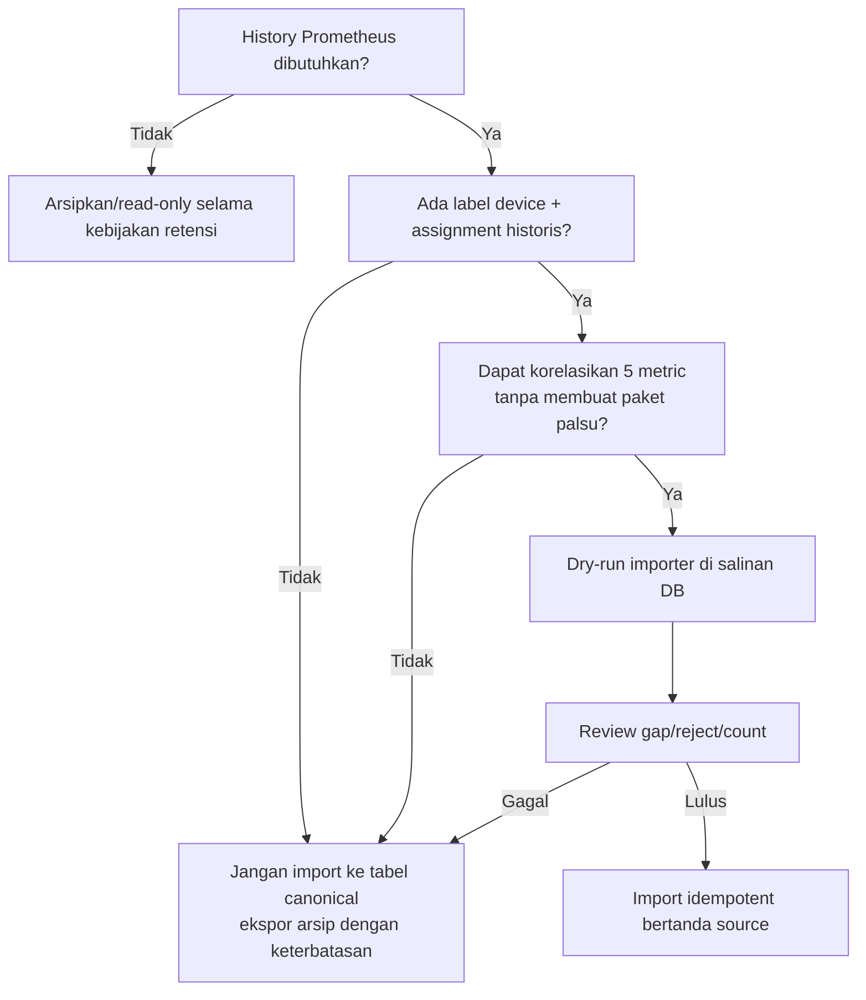

# Rencana Implementasi e-Sniffer Udang

Dokumen ini adalah urutan kerja setelah rancangan disetujui. **Tidak ada langkah di bawah yang telah diimplementasikan pada tahap dokumentasi ini.** Kebutuhan dan acceptance test dirujuk dari [02-skpl.md](./02-skpl.md), sedangkan kontrak rinci ada di [03-technical-design.md](./03-technical-design.md).

## 1. Prinsip delivery

- Satu perubahan kecil dan dapat diuji per tahap; jalur Prometheus lama tidak dihapus sebelum cutover tervalidasi.
- Schema berkembang dengan pola expand/migrate/contract dan migration dijalankan satu kali per release.
- Kontrak telemetry dan fixture dibuat sebelum firmware/worker dikembangkan paralel.
- Setiap tahap memiliki exit criteria; jangan lanjut hanya karena kode “sudah selesai”.
- Nilai target yang berstatus TBD disahkan lewat spike/load test, bukan asumsi.
- Tidak ada credential nyata, data produksi, atau file environment yang masuk Git.

## 2. Gate keputusan sebelum coding

Owner produk/hardware/operasional perlu mengonfirmasi atau memberi baseline sementara untuk:

| Gate | Keputusan | Dampak bila belum ada |
|---|---|---|
| G-01 | Jumlah device/chamber pilot; maksimal device aktif per chamber | Constraint assignment dan sizing |
| G-02 | Bentuk raw sensor, rentang elektrik/fisik, arti error | Validator dan tipe data |
| G-03 | Interval publish, toleransi jam, umur backlog, uptime width/wrap, anchor UTC+uptime dan uncertainty | Firmware payload/buffer, rekonstruksi waktu, freshness, assignment |
| G-04 | Spesifikasi VPS, disk, RPO/RTO, retensi | Pool, backup, kapasitas, load target |
| G-05 | Setujui baseline usulan akun lokal+session opaque atau pilih OIDC | Schema/dependensi auth dan proteksi endpoint |
| G-06 | Domain/certificate HTTPS+MQTTS dan posisi reverse proxy | Deployment dan provisioning device |
| G-07 | Wajib/tidaknya import history Prometheus dan label yang tersedia | Tool import/cutover |

Coding dapat dimulai dengan konfigurasi placeholder untuk G-01–G-04, tetapi production cutover tidak boleh melewati gate tersebut. G-05 dan G-06 wajib selesai sebelum akses jaringan produksi.

## 3. Urutan fase

### Fase 0 — Konfirmasi, baseline, dan test inventory

**Tujuan:** membekukan istilah, batas, dan bukti perilaku lama.

Pekerjaan:

1. Selesaikan gate G-01–G-07 atau tandai keputusan sementara dengan owner/tanggal kedaluwarsa.
2. Rekam fixture respons `/api/sensor/[chamberId]` dan state visual yang perlu dipertahankan tanpa menyalin secret.
3. Inventaris firmware/exporter Prometheus secara read-only: format sensor, label, interval, dan kemampuan queue/NTP.
4. Definisikan test IDs dari SKPL sebagai test cases runnable/traceable.
5. Uji baseline resmi Prisma `7.9.1` dan Mosquitto `2.1.2` terhadap versi exact Node, PostgreSQL, MQTT client, serta image digest. Prisma 7 dipilih sebagai baseline supported, bukan diklaim major terbaru.

Exit criteria:

- keputusan kritis tercatat;
- fixture valid/invalid/duplicate-identik/ID-conflict/backlog-known/backlog-unknown/status live+retained tersedia;
- compatibility matrix versi disetujui;
- tidak ada klaim layanan aktif hanya dari kode.

### Fase 1 — Fondasi repository dan kontrak bersama

**Tujuan:** membuat struktur tanpa mengubah sumber data dashboard produksi.

Perubahan yang diperkirakan:

- tambahkan `shared/telemetry-schema.ts`, type/unit/status;
- tetapkan kontrak typed error/reason dan logger terpusat (format JSON, redaksi, batas panjang input, konteks korelasi) yang dipakai web/worker;
- tambahkan test runner dan fixture JSON;
- tambahkan skeleton `worker/` tanpa mengaktifkan subscription produksi;
- tambahkan `.env.example` berisi nama variable/placeholder saja;
- tambahkan lint/typecheck/test scripts dan CI read-only.

Pengujian:

- schema menerima paket valid;
- menolak error struktur: tipe/string/NaN/object wajib hilang/ukuran lebih;
- kegagalan sensor yang valid secara struktur menjadi null+quality tanpa menolak paket;
- topic ID dan payload ID harus sama.
- canonicalization deterministik memberi hash sama untuk JSON semantik sama dan hash berbeda saat isi berubah;
- contract waktu mencakup synced, reconstructed dari anchor boot sama, dan unknown tanpa receipt fallback;
- status contract mencakup boot/session/sequence, connect, heartbeat, dan fixed LWT.

Exit criteria: T-ING-02/T-ING-03 contract tests hijau dan bundle web tidak mengimpor dependency worker.

### Fase 2 — PostgreSQL dan Prisma

**Tujuan:** source of truth dan constraint siap sebelum ingestion.

Perubahan yang diperkirakan:

- dependency Prisma 7 exact, PostgreSQL driver/adapter exact;
- `prisma/schema.prisma`, `prisma.config.ts`, migration awal yang direview;
- model `DeviceTimeReference` untuk anchor same-boot dan rekonsiliasi unresolved;
- SQL tambahan constraint rentang assignment, known/unknown time, value-quality, dan global history sequence setelah pendekatan dipilih;
- model User/AuthSession baseline usulan atau schema adapter OIDC setelah G-05;
- singleton client terpisah untuk web/worker;
- seed data development yang tidak menyerupai credential produksi;
- repository/service query beserta integration test PostgreSQL sementara.
- review query plan untuk latest/history/series dan daftar admin, termasuk pemeriksaan N+1 serta batas pool per proses.

Urutan review migration:

1. generate migration tanpa menerapkan ke produksi;
2. review SQL: tipe `timestamptz`, nama snake_case, FK `RESTRICT`, unique/index;
3. uji deploy ke DB kosong dan DB berdata fixture;
4. uji rollback aplikasi terhadap schema expanded;
5. baru izinkan one-shot `migrate deploy` pada environment target.

Pengujian: T-ADM-01/02, T-ING-05/07/08/09/10, T-HIS-04, T-AUT-02, T-DAT-01. Exit criteria: unique+hash conflict, nullable unresolved time, history watermark, auth token hash, dan non-overlap terbukti; query plan latest/history memakai total-order index pada volume representatif.

### Fase 3 — Mosquitto, worker, dan firmware canary

**Tujuan:** telemetry valid tersimpan end-to-end tanpa bergantung proses web.

Perubahan yang diperkirakan:

- konfigurasi Mosquitto dev/test: listener, anonymous off, ACL, persistence, limits;
- worker connection/reconnect, graceful shutdown, bounded concurrency;
- pipeline identity+canonical hash → committed lookup → validasi pesan baru → transaction → application ACK;
- status connect/heartbeat/LWT dengan retained replay handling dan `last_seen_at` terpisah dari processing time;
- firmware test publisher atau simulator deterministik;
- metric/log/health worker.
- log batas proses memakai `device_id`/`message_id` yang sudah divalidasi; accepted/duplicate rutin dihitung lewat metric, tanpa INFO per paket.

Urutan implementasi worker:

1. parser topic, hard payload size limit, strict JSON envelope, dan identity match;
2. RFC 8785 canonicalization + SHA-256;
3. lookup committed `(device_id,message_id)`: same hash → duplicate; different hash → conflict;
4. untuk pesan baru saja: full schema, device active, sensor normalization, waktu/backlog, lalu assignment lookup bila waktu known;
5. unknown-time disimpan device-scoped tanpa chamber/history sequence; reconciliation hanya dari anchor boot valid;
6. transaction insert + history sequence untuk reading visible;
7. ACK accepted/accepted-unresolved/duplicate/rejected permanen;
8. transient retry/backpressure;
9. status session ordering, retained replay, heartbeat/LWT, dan metrics.

Pengujian wajib:

- T-ING-01 valid;
- T-ING-04 unknown device;
- T-ING-05 triple duplicate;
- T-ING-06 backlog known-time/latest;
- T-ING-07 message ID sama dengan isi berbeda;
- T-ING-08 retry committed setelah pemindahan perangkat;
- T-ING-09 retry committed setelah device dinonaktifkan;
- T-ING-10 backlog tanpa waktu tepercaya tetap unresolved;
- T-STS-02 retained online setelah worker restart tidak memajukan last seen/tidak langsung online;
- T-REL-01 DB down/recovery;
- T-REL-02 worker restart;
- T-REL-03 broker restart;
- T-SEC-03 cross-device ACL.

Exit criteria: semua skenario lulus dengan bukti count DB, stored hash, ACK/reason, assignment immutable, state status, dan tanpa duplicate row; queue limits serta perilaku penuh terdokumentasi.

### Fase 4 — HTTP API v1 dan autentikasi

**Tujuan:** membuka akses typed dan terlindungi ke data PostgreSQL.

Urutan endpoint:

1. baseline auth usulan: User/AuthSession, login/logout/session, bootstrap admin, hash password+token, revoke/expiry/disable, CSRF dan rate limit; atau OIDC ekuivalen bila G-05 berubah;
2. error envelope, request ID, validation, auth guard, rate/range limits;
3. chamber list/admin;
4. device list/admin, assignment, dan audit unresolved-time khusus admin;
5. latest yang hanya memakai known-time visible reading;
6. raw history dengan total-order cursor dan snapshot watermark;
7. series dengan bucket whitelist;
8. CSV streaming.

Pertahankan `/api/sensor/[chamberId]`. Awalnya tetap Prometheus; setelah verifikasi data baru, tambahkan source switch server-side/compatibility facade yang dapat dikembalikan tanpa deploy firmware.

Pengujian:

- contract test seluruh status 2xx/4xx/5xx;
- T-API-01, T-HIS-01/03/04, T-EXP-01;
- T-AUT-01/02 login, expiry, revoke, disable, dan no-plaintext-token;
- T-SEC-01/02/04;
- timeout/abort dan CSV backpressure;
- query plan/range limit untuk mencegah full scan tanpa batas.
- request ID yang sama muncul pada respons error dan log batas HTTP/CSV; error domain tidak dicetak lagi oleh query/helper.

Exit criteria: tidak ada endpoint domain anonim; viewer/admin matrix hijau; OpenAPI atau kontrak ekuivalen cocok dengan response fixture.

### Fase 5 — Dashboard, grafik persisten, dan ekspor

**Tujuan:** mempertahankan visual relevan sambil mengganti semantik data.

Perubahan yang diperkirakan:

- chamber/navigation dari API, bukan hard-coded;
- satu data hook/poller latest per chamber;
- empat dimensi independen: request state, connection, freshness, dan quality per sensor;
- `ChartPanel` memakai `/series`, range tersimpan di URL agar refresh stabil;
- `ExportPanel` menjadi kontrol aksesibel dengan from/to dan download nyata;
- angka tetap numeric sampai formatting UI; unit/quality/timestamp ditampilkan;
- pause/throttle polling saat hidden, prevent overlap, timeout dan backoff.

Komponen presentasional dan tema yang masih relevan dipertahankan. Jangan menampilkan label “Live” hanya karena satu fetch selesai.

Pengujian: T-HIS-02, T-STS-01/02, T-UI-01, accessibility dasar, perubahan chamber, refresh, 503, data null, online+stale, offline+fresh, dan satu sensor gagal. Exit criteria: kombinasi dimensi dapat didemonstrasikan dengan fixtures dan refresh tidak menghilangkan grafik.

### Fase 6 — Container dan hardening VPS

**Tujuan:** release repeatable dan recoverable.

Perubahan yang diperkirakan:

- multi-stage `deploy/Dockerfile`/root Dockerfile yang sesuai build Next.js 16;
- `deploy/compose.yaml` untuk web/worker/postgres/mosquitto;
- network/volume/healthcheck/restart/graceful stop/resource limit;
- rotasi ukuran/jumlah file dan retensi log container/host; DEBUG nonaktif secara default di produksi;
- reverse proxy dan firewall runbook;
- one-shot migration command/job;
- backup script, checksum, off-host transfer, restore runbook;
- image/dependency pin dan vulnerability review.

Validasi:

- hanya port yang disetujui tampak dari luar;
- PostgreSQL tidak memiliki host port;
- container berjalan non-root sejauh image memungkinkan;
- secret tidak ada dalam image/history/log;
- canary secret dan payload penuh tidak muncul di log; outage berulang menghasilkan ringkasan terbatas, bukan banjir ERROR identik;
- restart dependency satu per satu;
- fault test membuktikan liveness proses tetap 200 saat dependency outage, sementara readiness 503 lalu pulih;
- restore drill T-DAT-02;
- load test T-PER-01 dan observability T-OBS-01.

Exit criteria: staging dapat dibangun dari clean checkout, di-migrate satu kali, di-smoke-test, di-backup, dan dipulihkan melalui runbook.

### Fase 7 — Pilot paralel dan keputusan history

**Tujuan:** membuktikan jalur baru sebelum cutover.

1. Provision satu perangkat canary dengan credential/ACL sendiri.
2. Jalankan Prometheus lama dan MQTT/PostgreSQL baru paralel selama window yang disetujui.
3. Bandingkan jumlah sampel, nilai, timestamp skew, invalid/reject, reconnect, backlog, dan resource VPS.
4. Jalankan simulasi DB down, worker restart, broker restart, network flap, dan queue penuh pada staging/canary.
5. Audit data Prometheus untuk memutuskan import, arsip, atau tidak migrasi sesuai syarat pada technical design.
6. Dapatkan sign-off hardware, backend, dan pengguna dashboard.

Exit criteria: tidak ada kehilangan/duplikat di luar kebijakan terukur, target disahkan, rollback rehearsal berhasil, dan keputusan history tertulis.

### Fase 8 — Cutover dan dekomisioning bertahap

**Tujuan:** memindahkan source of truth dengan rollback window.

Urutan release:

1. backup dan verifikasi kapasitas/health;
2. jalankan one-shot migration;
3. deploy worker lalu web/API compatible;
4. alihkan device secara batch kecil;
5. alihkan UI/facade ke PostgreSQL;
6. pantau acceptance, duplicate, reject, lag, API 5xx, disk, dan pool;
7. tahan Prometheus/adapter lama selama rollback window;
8. setelah sign-off, buat perubahan terpisah untuk deprecation/removal.

Trigger rollback usulan: ingestion loss yang tidak dapat dijelaskan, error rate di atas threshold yang disahkan, mapping chamber salah, backlog tak terkendali, atau data UI tidak dapat dipercaya. Rollback mengarahkan web ke source lama dan menghentikan ekspansi firmware; tidak menghapus database baru.

## 4. Work breakdown dan dependensi

| Work item | Hasil | Bergantung pada | Kebutuhan |
|---|---|---|---|
| W-01 Kontrak telemetry/status | schema+fixtures+canonical hash+time anchor | G-02/G-03 | KF-ING-001–004, KF-STS-001 |
| W-02 Schema DB | reviewed migration | G-01, W-01 | KF-ADM-*, KF-ING-003/004 |
| W-03 Broker security | TLS/auth/ACL/persistence | G-06 | KNF-SEC-001, KNF-REL-002 |
| W-04 Worker ingest | daemon tested | W-01/W-02/W-03 | KF-ING-001–004 |
| W-05 Status/LWT | session-aware connection evidence | W-03/W-04 | KF-STS-001 |
| W-06 Auth HTTP | local User/AuthSession baseline atau OIDC+two roles+CSRF | G-05 | KF-AUT-001, KNF-SEC-002 |
| W-07 Master-data API | chamber/device/assignment | W-02/W-06 | KF-ADM-*, KF-API-001 |
| W-08 Read API | latest/history/series | W-02/W-06 | KF-LAT-001, KF-HIS-* |
| W-09 CSV | streaming export | W-08 | KF-EXP-001 |
| W-10 Dashboard | persistent UI states | W-05/W-08/W-09 | KF-UI-001 |
| W-11 Compose/operations | deploy+backup+health | W-03–W-10, G-04/G-06 | KNF-REL/DAT/OBS/PER |
| W-12 Pilot/cutover | signed evidence | seluruhnya | semua Must |

## 5. Strategi pengujian

### Piramida

- **Unit:** strict schema vs per-sensor error, canonical hash, dedupe decision order, time reconstruction/unknown, status session ordering, freshness, snapshot cursor, CSV escaping, auth token hashing, error mapping.
- **Review statis terarah:** pemakai fungsi/helper, import/dependency mati, duplikasi aturan domain, dan serialisasi error/request yang berisiko membocorkan data.
- **Integration:** PostgreSQL nyata untuk transaction/constraint/query; Mosquitto nyata untuk QoS/ACL/session/LWT; Route Handler dengan auth+DB.
- **End-to-end:** simulator device → broker → worker → DB → API → browser/export.
- **Fault injection:** DB/broker/worker/network restart, slow query, disk/queue threshold dalam environment aman.
- **Load/soak:** jumlah device target × interval, backlog burst, concurrent dashboard/CSV.

### Skenario konsistensi wajib hasil review

| Test ID | Setup/aksi | Hasil yang wajib |
|---|---|---|
| T-ING-07 | Commit payload A, kirim payload B dengan device/message ID sama tetapi satu field berbeda | Row A tidak berubah; hash berbeda terdeteksi; ACK sukses/duplicate tidak dikirim; `rejected/MESSAGE_ID_CONFLICT` dan metric tercatat |
| T-ING-08 | Commit reading saat device di Chamber A, pindahkan device ke B, retry payload identik | Lookup committed terjadi sebelum assignment; ACK `duplicate` menunjuk reading/assignment A tanpa row baru atau remap |
| T-ING-09 | Commit reading, disable device, retry identik lalu kirim message ID baru | Retry mendapat `duplicate`; pesan baru mendapat `DEVICE_DISABLED`; row count tetap untuk retry |
| T-ING-10 | Kirim backlog dengan `measured_at=null` tanpa anchor boot tepercaya | Commit `accepted_unresolved_time`; measured/chamber/assignment/history sequence null; tidak muncul di latest, freshness, series, CSV/history chamber |
| T-STS-02 | Simpan `last_seen_at`, restart worker, terima retained online, lalu heartbeat live | Retained hanya memajukan processed time dan membuat connection unknown/evidence retained; `last_seen_at` tidak berubah; heartbeat live baru membuat online dan memajukan last seen |
| T-HIS-04 | Ambil page 1 dan watermark; insert backlog/reconcile reading yang sort time-nya berada di tengah; lanjutkan cursor | Traversal lama tidak melihat row baru dan tidak duplicate/skip row snapshot; traversal baru melihat row tersebut pada posisi total-order yang benar |
| T-OBS-01 | Putus DB atau broker tanpa mematikan proses, lalu pulihkan | Liveness tetap 200; readiness 503 selama dependency wajib gagal dan kembali 200 setelah recovery |
| T-LOG-01 | Jalankan HTTP/MQTT dengan canary password/token/cookie/URL rahasia, payload sensor, dan ID input yang panjang | Tidak ada secret/payload penuh di log; field eksternal dibatasi; `request_id` atau device/message ID yang valid konsisten dari ingress sampai outcome |
| T-LOG-02 | Kirim telemetry sukses+duplicate berulang, picu outage DB berulang, pulihkan MQTT, lalu hasilkan log sampai melewati batas file uji | Tidak ada INFO per paket atau WARN otomatis pada duplicate normal; counter/latency benar; ERROR identik dibatasi dan jumlah suppressed diringkas; lifecycle serta disconnect/reconnect tercatat pada level sesuai; rotasi dan retensi membatasi jumlah/ukuran file |
| T-KOD-01 | Review semua modul baru dan jalankan fixture validasi/normalisasi/waktu/deduplikasi/error pada jalur terkait | Tidak ada helper/import/dependency tanpa pemakai atau aturan domain ganda yang memberi hasil berbeda; fungsi memiliki input/output dan tanggung jawab jelas |
| T-EFI-01 | Profil list/latest/history/series, satu tab dashboard, dan beban telemetry pilot | Tidak ada N+1, pool/client per request/pesan, polling latest ganda, atau query ulang tanpa kebutuhan; plan indeks dan batas resource terdokumentasi |
| T-EFI-02 | Jika batching diterapkan, uji pesan valid, duplikat, conflict, DB gagal, dan restart di tengah batch | Urutan, transaksi, unique constraint, dan ACK hanya setelah commit tetap benar; benchmark sebelum/sesudah memakai beban/lingkungan sama |

Tambahan T-ING-06 membuktikan backlog dengan waktu known dan assignment historis valid masuk history tanpa mengganti latest; T-ING-03 membuktikan error per sensor disimpan null+quality sementara error struktur T-ING-02 menolak seluruh paket.

### Bukti per test run

Setiap skenario minimum menyimpan: versi image/dependency, config non-secret, input fixture, row count/query result, ACK/outcome, log correlation ID, dan pass/fail. Untuk fault test sertakan timeline recovery dan duplicate/loss count.

### Definition of done umum

- requirement ID dan test ID tercantum pada perubahan;
- fungsi mempunyai input/output dan tanggung jawab yang jelas; hapus fungsi, helper, import, dependency, wrapper, dan cabang yang tidak dipakai;
- aturan validasi, normalisasi, deduplikasi, timestamp, dan format error tidak berbeda antarjalur yang memakai domain sama;
- periksa operasi I/O ulang, N+1, pool per pesan/request, polling ganda, dan batas concurrency/queue/range/payload;
- lint, typecheck, unit, integration relevan hijau;
- migration direview dan diuji dari kosong serta upgrade;
- setiap jalur gagal dapat ditelusuri dengan ID korelasi; detail error dicatat sekali pada batas yang tepat, level benar, tanpa pengulangan antar lapisan;
- redaksi, batas panjang input log, rate limit error identik, rotasi, retensi, metric, dan dokumentasi operasi diverifikasi;
- optimasi yang dilakukan dilaporkan dengan alasan teknis dan bukti relevan; klaim peningkatan performa memerlukan hasil ukur sebelum/sesudah;
- tidak ada secret, `NEXT_PUBLIC_*` credential, atau endpoint mutasi anonim;
- rollback atau compatibility impact dijelaskan.

## 6. Migrasi data Prometheus — decision tree

Importer, bila dibuat, adalah pekerjaan terpisah dan tidak berjalan pada startup web/worker.

## 7. Risiko dan mitigasi

| Risiko | Dampak | Mitigasi/gate |
|---|---|---|
| Device clock/anchor salah | urutan/latest dan assignment salah | known/unknown model, same-boot anchor+uncertainty, tanpa receipt fallback, canary |
| ID dipakai ulang dengan isi berbeda | data diam-diam salah | canonical SHA-256, permanent conflict reject, metric/alert |
| Retained online usang | false online dan last seen palsu | retain flag+session identity, unknown hingga live heartbeat, processing time terpisah |
| Backlog muncul di tengah pagination | duplicate/missing antarhalaman | global history sequence + frozen watermark + total-order cursor |
| Buffer flash terlalu kecil/rusak | data outage hilang | kapasitas berdasar outage, CRC/wear strategy, drop counter |
| Backlog burst | DB/API contention | oldest-first rate limit, bounded worker concurrency, pool limit |
| QoS disalahartikan | sukses palsu | application ACK setelah commit, test DB down |
| Assignment overlap | lokasi historis ambigu | DB constraint/transaksi + admin test concurrency |
| Growth lebih besar dari estimasi | disk penuh | metric disk/table/index, capacity review, retensi disahkan |
| CSV/query rentang besar | resource exhaustion | auth, range/row limit, streaming, timeout, rate limit |
| Credential device bocor | publish palsu | per-device credential, ACL, revoke/rotate, TLS |
| Baseline auth lokal belum disetujui/diganti OIDC | admin API tertunda/tidak aman | G-05 wajib sebelum endpoint production; dependensi alternatif dicatat |
| Import Prometheus ambigu | history palsu | decision tree; provenance; default tidak import |
| Migration irreversible | downtime/data loss | expand-contract, backup/restore drill, one-shot job |
| Satu VPS gagal total | outage semua layanan | backup off-host; RPO/RTO transparan; HA di luar scope awal |

## 8. Checklist cutover

### Sebelum

- [ ] Semua kebutuhan Must memiliki hasil test pass.
- [ ] TLS certificate, ACL, rotasi/revoke credential diuji.
- [ ] Backup terbaru lolos checksum dan restore drill.
- [ ] DB capacity, disk headroom, pool, queue limits, retention disahkan.
- [ ] Kombinasi dimensi UI (termasuk online+stale, offline+fresh, satu sensor gagal) dan CSV diverifikasi pengguna.
- [ ] Runbook deploy, rollback, DB down, broker down, dan disk pressure tersedia.
- [ ] Source Prometheus lama dan compatibility facade masih dapat digunakan.

### Saat

- [ ] Freeze perubahan schema lain.
- [ ] Catat versi/image/migration dan waktu mulai.
- [ ] Jalankan migration satu kali, lalu smoke query.
- [ ] Alihkan canary sebelum batch lain.
- [ ] Pantau accepted/duplicate/rejected, lag, 5xx, pool, queue, CPU, memory, disk.

### Sesudah

- [ ] Cocokkan count telemetry dengan publish count/counter device.
- [ ] Verifikasi latest tidak berubah oleh backlog lama; unknown-time tidak tampil sebagai latest/lokasi.
- [ ] Verifikasi traversal pagination tidak berubah ketika backlog/reconciliation masuk.
- [ ] Verifikasi riwayat dan CSV setelah refresh/login ulang.
- [ ] Catat keputusan go/rollback dan owner.
- [ ] Hapus jalur lama hanya pada perubahan berikutnya setelah rollback window.

## 9. Hasil akhir yang diharapkan

Tahap implementasi dinyatakan selesai ketika device terautentikasi dapat mengirim paket multi-sensor, satu paket committed tepat satu kali secara efektif, lokasi historis hanya diklaim bila waktu+assignment dapat dibuktikan, data unresolved tetap terpisah, API/dashboard mengomposisikan seluruh dimensi status, riwayat/CSV persisten, dan stack empat service dapat dipulihkan dari backup. AI, alarm bisnis, aktuator, eksperimen, multi-tenant, dan RBAC kompleks tetap di luar hasil ini.
